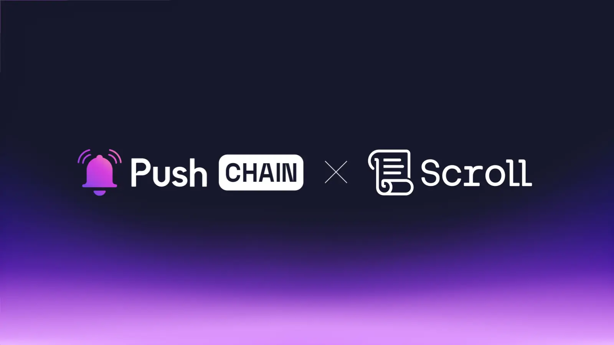

<!--truncate-->

Scroll is coming to Push Chain!

It’s time to make EVM’s Open Economy Universally Accessible to anyone from anywhere, be it evm or non-evm.

## What is Scroll?

[Scroll](https://scroll.io/) is an EVM compatible - Layer 2 Scaling Solution. At a finer level, Scroll is a zkEvm Rollup - that executes and publishes transactions to Ethereum in bundles, which then can be proved with minimum compute requirements while preserving transaction privacy using Zero Knowledge technology.

Scroll is a byte-code equivalent zkevm that closely emulates EVM, enabling almost identical development and user experiences to Ethereum.

Developing on Scroll is super easy for Ethereum Devs :

- Solidity, Vyper, and Huff work out of the box
- No re-auditing necessary
- Most existing tooling is inherited

## What is Push Chain?

Push Chain is a shared state blockchain for universal apps, powered by **Chain Abstraction**. It is a Proof of Stake (PoS) chain that allows developers to create universal apps and act as a shared settlement layer for multiple L1s, L2s, and L3s enabling transactions from any chain - any app and any user.

**Push Chain's Superpowers Include:**

- Consumer tx (unordered) and Traditional tx (ordered)

- Any Chain Tx (Solana, Eth, EVM, or non-EVM)

- Sub-second finality**  

- True Scale and Universal Smart Contracts

- Wallet and Fee Abstraction

[Explore more about Push Chain here](https://push.org)

## **👥 What does this mean for Scroll and Push Chain Users?**

**Explore non-evm without leaving Scroll**

Scroll users can interact with DApps across Solana, Aptos, Bitcoin L2s or any other non evms via Push’s Shared Settlement Layer. All, without manually bridging funds, installing and learning complex wallet systems and ever-leaving Scroll’s Ecosystem Comfort.

**Universal  Identity**

Exploring an open and universal web3 economy requires a universal passport.

This is where Push ID makes a difference- Provides a universal identity system that seamlessly connects all their wallets (EVM and non-EVM) into one profile.
Enabling users to track their web3 activity, across Scroll, Ethereum, Solana or any other chain in a unified manner.

The opportunities with Push ID are endless:
Think about gated applications - where you’re universal passport gives you access based on your web3 repetition. Or  instances where an app requires you to KYC to prove cross-chain asset ownership.

Additionally, with this partnership - Developers get an opportunity to lean on Scroll’s decentralized prover network and work on fascinating new areas such as post-danksharding blob markets, hardware-friendly ZK algorithms and new ZK primitives. With Push Chain - Devs will be able to take these innovations one notch higher by unlocking the states of other layer 1s and layer 2s, in order to build truly scalable consumer-friendly apps.

## 👷‍♂️ What does this mean for builders?

**Build Apps that enable Txns from Any Chain**

Push Chain supports transactions from any wallet, regardless of the originating chain—be it Ethereum, Solana, or any other L1s, L2s or L3s.

Use [Push Chain’s Universal SDK](https://push.org/docs) to bring these apps to life - opening doors to craft chain abstracted experiences.

**Build hyper-scalable consumer apps**

Using Scroll’s inherent scalability strength and Push Chain’s **Sharded Storage and Parallel txn processing** - Devs can build *hyperscalable consumer apps*  that can be executed with sub-second finality using Push’s  borderless & stateless consumer txns.

*This is the era of Consumer DApps thriving with millions of users!*

Additionally, with this partnership - Developers get an opportunity to lean on Scroll’s decentralized prover network and work on fascinating new areas such as post-danksharding blob markets, hardware-friendly ZK algorithms and new ZK primitives. With Push Chain - Devs will be able to take these innovations one notch higher by unlocking the states of other layer 1s and layer 2s, in order to build truly scalable consumer-friendly apps.

## 🔓 Use case unlock

**Universally playable games:**
MMORPG games like [Omnikingdoms](https://www.omnikingdoms.io/) can support users from any non-evm chain supporting in game purchases, state transitions and much more.

Even Multiplayer games like roulette, casinos and RPG games on Scroll can utilize Push Chain to bring users across different chains to compete together in a unified manner.

**Universal NFTs:**

*Shared state + universal smart contracts = true multi-chain magic!*

Imagine launching Univeral NFT collections using launchpads like [Omnihub](https://omnihub.xyz/) and [NFTs2Me](https://nfts2me.com/) seamlessly across different L1s which can be traded and transfered across any chain!

**Universal Privacy:**

ZK tech has solved one of the biggest problems plaguing today’s internet, i.e. the trade-off between privacy and transparency. We are fast moving towards a world where every bit of valuable user-data will be ZK proved. With the Push x Scroll partnership, this important primitive will become truly universal and can be integrated with cross-chain applications as well as liquidity.

**Chain Agnostic AI Agents:**

Push Chain’s universal shared state and Scroll’s open economy  pave the way for a new generation of chain-agnostic AI agents. These agents can perform autonomous operations in a borderless manner - unlocking a wide variety of financial, mixed financial, and non-financial use cases.

## Next Steps

1. Follow [@PushChain on X](https://x.com/PushChain) to get the latest updates about Push Chain
2. Want to build on Push Chain? Explore the docs and example snippets here → [Push Chain Docs](https://push.org/docs/chain/)
3. Visit the [Push Chain Website](https://push.org/chain?utm_source=pushblog&utm_medium=referral&utm_campaign=pcgov) to find a one-pager explanation of the vision.
4. Check out the [Push Chain Whitepaper](https://whitepaper.push.org/?utm_source=pushblog&utm_medium=referral&utm_campaign=pcgov) for a detailed overview of the vision and the underlying technicalities.
5. [Push Chain Devnet](https://scan.push.org/?utm_source=pushblog&utm_medium=referral&utm_campaign=pcgov) is running live on Proof-of-Stake network validators, storage and archival nodes. The network already supports consumer transactions as well.
6. [Push Chain Simulate Tx](https://simulate.push.org/?utm_source=pushblog&utm_medium=referral&utm_campaign=pcgov) already provides a way for everyone to send tx from any chain using wallet abstraction.
