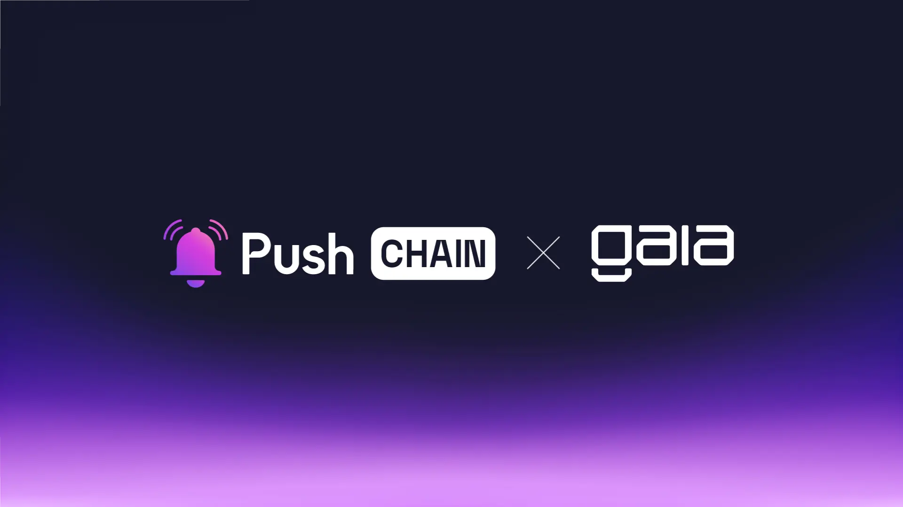

<!--truncate-->

It’s time to make on-chain AI Agents go Universal!
Push Chain is joining forces with Gaia Network to make chain abstracted AI Agents accessible to anyone via any chain, any wallet.

## What is Gaia?

[Gaia](https://www.gaianet.ai/) is an autonomous agents marketplace that enables anyone to build, deploy and utilize AI agents with unique expertise, & personalized capabilities.

As a decentralized computing network, Gaia powers its nodes with every essential component - required to seamlessly configure and operate AI agents.

Gaia node includes - a powerful cross-platform runtime, fine-tuned LLM, vectorDB and embedding models, prompt manager and much more.

## What is Push Chain?

Push Chain is a shared state blockchain for universal apps, powered by Chain Abstraction. Push is a Proof of Stake (PoS) chain that allows developers to create universal apps and act as a shared settlement layer for multiple L1s, L2s, and L3s enabling transactions from any chain - any app and any user.

**Push Chain's Superpowers Include:**

- Consumer tx (unordered) and Traditional tx (ordered)

- Any Chain Tx (Solana, Eth, EVM, or non-EVM)

- Sub-second finality\*\*  

- True Scale and Universal Smart Contracts

- Wallet and Fee Abstraction

[Explore more about Push Chain here](https://push.org)

## 👥 What does this mean for Gaia and Push Chain Users?

**Interact with Universally operable AI Agents**

With Push’s Universal capabilities - users operating AI agents built on Gaia can conveniently perform autonomous tasks across any chain!

## 👷‍♂️ What does this mean for Builders?

**Develop Universally Operable AI Agents**

With Gaia and Push, Builders can create borderless ai agents - that can perform financial, mixed financial and consumer read/write operations across any chain in an autonomous manner.

**Build Agents with Universal Identities**

Leveraging PushID ( A unified user identity by Push Chain that spans across every user wallet, both EVM and non-EVM). Instances of Gaia agents can carry a unified identity that aggregates their activity across all chains - simplifying agent tracking, history collection and analysis.

## 🔓Usecase unlock

**Cross Chain AI agents with autonomous intelligence**

Having the ability to execute actions between any chains, irrespective of their virtual machine design, with the power of Push Chain’s Universal Smart Contracts and Shared State ledger.

**Unified Data Layers for AI Agents**

Data Layers like [Oxscope](https://www.0xscope.com/) can utilize Push Chain’s shared state settlement layer to read transactions across chains in a unified manner.

**Chain Agnostic Autonomous Actions**

Autonomous agents like [Eliza](https://github.com/elizaOS/eliza) can extend its support for Push Chain, opening opportunities for chain-abstracted interoperable communications and actions.

Example: rebalance a user's DeFi positions on Ethereum, list NFTs on Polygon, and communicate status updates to the user via a messaging app on another chain, all through one unified settlement layer

## Next Steps

1. Follow [@PushChain on X](https://x.com/PushChain) to get the latest updates about Push Chain
2. Want to build on Push Chain? Explore the docs and example snippets here → [Push Chain Docs](https://push.org/docs/chain/)
3. Visit the [Push Chain Website](https://push.org/chain?utm_source=pushblog&utm_medium=referral&utm_campaign=pcgov) to find a one-pager explanation of the vision.
4. Check out the [Push Chain Whitepaper](https://whitepaper.push.org/?utm_source=pushblog&utm_medium=referral&utm_campaign=pcgov) for a detailed overview of the vision and the underlying technicalities.
5. [Push Chain Devnet](https://scan.push.org/?utm_source=pushblog&utm_medium=referral&utm_campaign=pcgov) is running live on Proof-of-Stake network validators, storage and archival nodes. The network already supports consumer transactions as well.
6. [Push Chain Simulate Tx](https://simulate.push.org/?utm_source=pushblog&utm_medium=referral&utm_campaign=pcgov) already provides a way for everyone to send tx from any chain using wallet abstraction.
