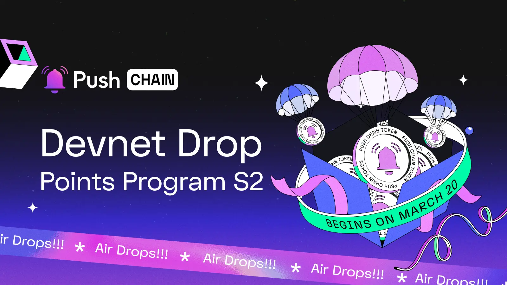

<!--truncate-->

The announcement you’ve been eagerly waiting for is here!

Say Hello to [Push Chain Devnet Drop Points Program S2!](https://portal.push.org/rewards)

The Devnet Drop Points Program leads to one of many upcoming Gratitude Drops scheduled to give back to our amazing Push Chain community as we collectively turbo charge our way towards the Push Chain Mainnet 🚀

***How do I participate in Devnet Drop Points Program?***

***Who is this drop eligible for?***

***Does the Devnet Drop Points Program benefit Points Program S1 participants?***

***How awesome is Push Chain?***

This guide entails all the required details for you to kick start your Universal Appverse journey with Push!

*Don’t skip the extra perks section at the end!*

## What is the Push Chain Devnet Drop Points Program?

The [Push Chain Devnet Drop Points Program](https://portal.push.org/rewards?utm_source=blog&utm_medium=referral&utm_campaign=push_rewards) - is an Incentivized Devnet Program tied together with Push Points Program S2 - enabling users to earn Push Points in exchange for Airdrops for exploring the Early Ecosystem apps of Push Devnet.

Points Earned will unlock your eligibility for the Push Chain Token Airdrop, post Push Chain Mainnet.

## How do I get started and what are the rules?

Quite Straightforward..

1) **Join the program at [https://portal.push.org/rewards](https://portal.push.org/rewards?utm_source=blog&utm_medium=referral&utm_campaign=push_rewards)**

2) **Connect using Push Wallet**

*Push Wallet is an in-browser wallet, which opens in a new tab.Thus, no downloads required.*
*You can connect using your existing Solana, EVM wallets to it - OR - Simply Login via Google & Email.*

3) **Validate your socials (X & Discord)** *(we hate bots🤖, we love fair play🤝)*

4) **Tweet about Push Chain**

5) **You’re all set!**

Now…..

**Dive into the realm of Push’s Universal Apps like**:

1. [Any Chain Mail](https://email.push.org) - Your wallet address = your email id.
2. [Transaction Simulator](https://simulate.push.org) - Send superfast txns on Push Chain - from any chain!
3. [Rumors](https://rumors.push.org)  - Share Secrets, No sign up, no personal data, vote on spicy rumors.
& 4. SURPRISE APP (revealing soon!)

Use these apps, perform actions (gasless + no money involved) and earn XP and Multipliers the more you level.

**There are 50 levels per app. The more you use an app, the more levels you climb, the more XP and Multipliers you earn and thus - higher you rank in the Leaderboard.**

### What’s special about Push Chain Devnet Universal Apps?

These apps are Universal in nature.

Meaning…

These apps have the ability to support users from any wallet, belonging to any chain - with ZERO Friction!!

For instance - With [Anychain Email](https://email.push.org) - a Solana user can instantly send mails to an Ethereum user - instantly, with 0 gas fees!!

All thanks to Push Chain’s Chain Abstraction and Full Stack Interoperability!

***For nerds - here’s a detailed read: [Innovations By Push Chain](https://push.org/blog/innovations-by-push-chain/)***

## Who Does the Devnet Drop Points Program Benefit?

Short Answer - Everyone!

Which also includes:

1️⃣ S2 Program Participants (of course!)

2️⃣ S1 Program Graduates (Push protocol users)

3️⃣ And EVERYONE who’s truly part of Push Chain’s Vision and its journey to Mainnet!

….

### **💡NOTE For S1 Participants:**

Claim an exclusive headstart boost **20k points + 4x Multiplier** just by logging in with the same socials & wallet used in S1.

## Extra Perks:

1. **⚡️ Multipliers:**

    Multipliers allow users to boost their Points by performing special activities. For e.g. if you have 100 points, after earning a 2x Multiplier, you will now have 200 Points. Multipliers also apply to any points earned after activating the Multiplier making it a permanent feature.

    The best part,

    **Multipliers are additive**. A 2X + 2X Multiplier will make the account multiplier 4X. Collect more multipliers to earn mega rewards.

2. **✅ Daily Reward CheckIns:**

    Users can also check-in daily on [Points Portal](https://portal.push.org/rewards?utm_source=blog&utm_medium=referral&utm_campaign=push_rewards) to claim points. Check-in for 7 days to earn bonus points.

    → Check in daily at [portal.push.org](https://portal.push.org/rewards?utm_source=blog&utm_medium=referral&utm_campaign=push_rewards) to earn **bonus 5,500 Points!**

    → Use Devnet Apps Daily to earn an additional **1000 XPs boost.**

3. **🤝 Referrals:**

    Onboard your loved ones to the S2 program & earn **+20%** of any Points your invites earn and **+5%** of any Points your invitee’s invites earn.

## Why is Push Chain Awesome?

Push Chain is a shared state blockchain for universal apps, powered by **Chain Abstraction**. It is a Proof of Stake (PoS) chain that allows developers to create universal apps and act as a shared settlement layer for multiple L1s, L2s, and L3s enabling transactions from any chain - any app and any user.

**Push Chain's Superpowers Include:**

- Complete Wallet and Fee Abstraction
- Support for Any Chain Tx (Solana, Eth, EVM, or non-EVM)
- True Scale and Universal Smart Contracts
- Consumer tx (unordered) and Traditional tx (ordered)
- Sub-second finality

[Explore more about Push Chain here](https://push.org/)

**⚡️READY, SET, EARN!**

**[https://portal.push.org/rewards](https://portal.push.org/rewards?utm_source=blog&utm_medium=referral&utm_campaign=push_rewards)**
