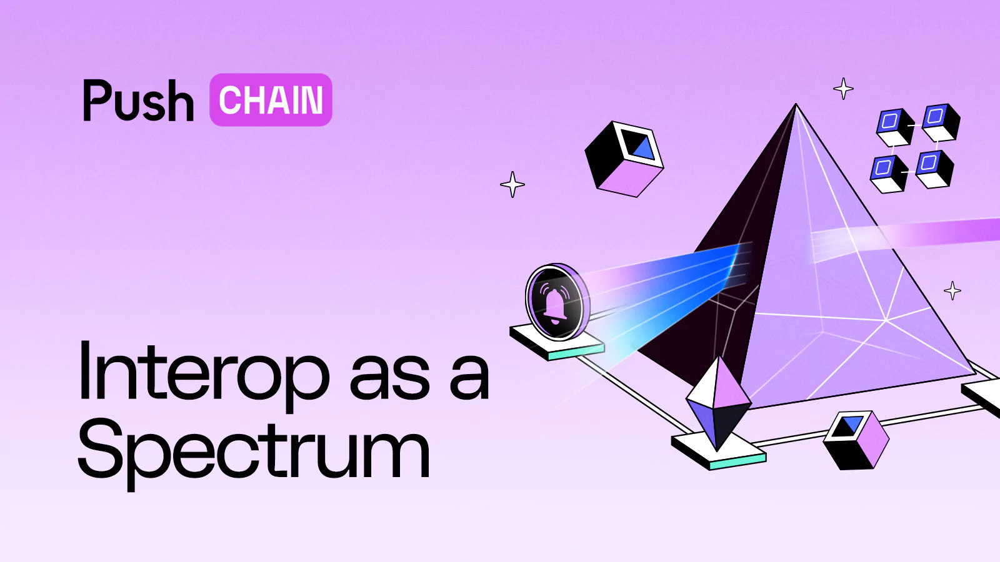
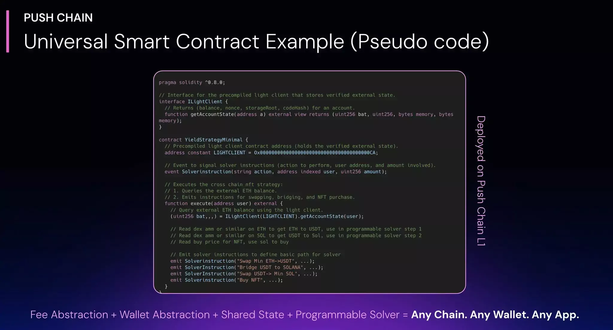
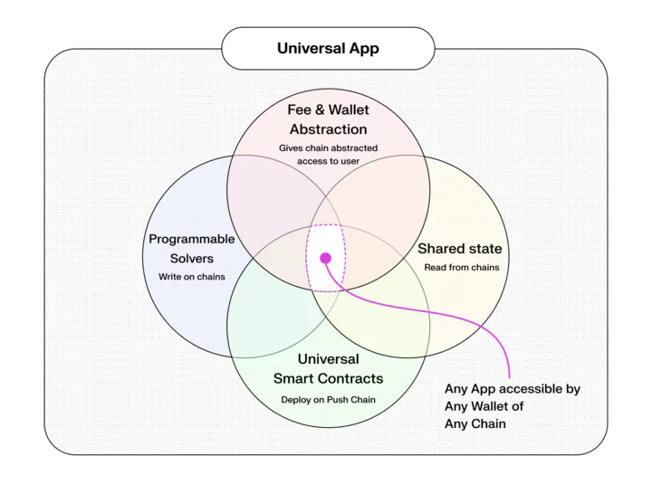

<!--truncate-->

## Intro

Web3 Interoperability (interop) is often seen as an imaginary creature, a unicorn that will never become real. This is because it's like a path on which the perfect destination is difficult to find, and there are tons of design choices, learning curves as well as UX compromises along the way.

Attempts to 'solve' interop within these constraints has led to a variety of solutions.

In this article, we provide a general overview of these approaches and show how they are all interconnected. We also highlight how the meaning of interop has shifted as the web3 industry has matured and expanded, and outline a possible endgame.

Before we get to that, i.e. full stack interoperability, we will discuss how interop started and, more importantly, why it should be viewed as a spectrum rather than a binary ‘0’ or ‘1‘. In reality, interop and the desire to defragment has been with us from the moment Bitcoin on/off-ramp came to existence!

## The Interop Spectrum

### 1. The First Interop - Centralized Exchanges

The desire for an interoperable and defragmented web3 has been with us ever since the first Bitcoin on/off-ramp took off. No sooner did it come into existence than our desire to make it tradable with traditional finance (TradFi) arose. This need was further deepened with the rise of other layer 1s such as Ethereum, Ripple, Cardano etc.

The user's need was clear: a unified interface which allowed the trading of different crypto assets directly and instantly. Centralised exchanges (CEXs) arose to fulfil this need. They abstracted away the complexity of different chains from the frontend at the cost of introducing trust assumptions and centralisation at the backend.

This era saw the origin of many CEXs, some of which have since disappeared (such as Mt. Gox), and others that have become household crypto names (such as Coinbase and Binance). While this worked for the users who wanted convenience, it also exposed issues with centralizing decentralized assets, giving us the next problem we had to tackle.

The Progressive Problem - CEXs, with their centralized custody, opened up new issues for crypto and web3. Most of them arose from the very nature of custodial design which included exchanges getting hacked, users getting locked out or losing time before getting their funds and of course, the rare but not uncommon issue of exchange founders vanishing with keys that custodied the user funds.

This led us, the web3 collective, to work towards solving these issues which resulted in the **next iterative innovation** in chasing interop. A solution known as **atomic swaps** - a method by which two chains could perform a trustless exchange.

### 2. Atomic Swaps - Hashlock time contracts between compatible chains

Atomic swaps were so named because they turned a 'swap' into a self-contained unit of operations on smart contracts which would succeed or fail as a bundle. This was done to prevent situations in which one side fulfils its side of the bargain but the other does not. We will later see how this idea of 'atomicity' survives to this day in solver networks.

Proposed on a Bitcoin forum in 2013 as 'hash-time locked contracts' (HTLCs), the first iteration of atomic swaps involved two smart contracts (one each on the source and destination chains) operating together to form a digital escrow with a shared secret.

What makes them historically significant is that they were the first peer-to-peer chain-agnostic interop solution. Initially, they unified the interop design space by showing that trustless cross-chain swaps were possible between all ecosystems. Over time, however, they resulted in a new round of competition between 'HTLC compatible' chains.

**The Progressive Problem** - Despite being peer-to-peer, HTLCs were unable to 'solve' the interop problem due to two important limitations: (a) They involved multiple transactions leading to scalability challenges. (b) Different blockchains had their own standards which were not compatible.

These bottlenecks led to the **next iterative innovations**: in the form of **decentralised exchanges** (DEXs) and **multi-chain wallets**.

### 3. Local Interop and non-custodial solutions

#### 3.1 Local Interop via DEXs

This breakthrough was led by Uniswap, which later pioneered not only decentralized finance (DeFi) but also kicked off the era of web3 apps. Its key innovation was to replace centralised orderbooks with automated market making algorithms (AMMs) and decentralised liquidity pools. This solved a lot of problems for advanced web3 users as they could conduct asset swaps directly from their wallets (yes if you used Metamask back then, you were an advanced user!).

Technically speaking, such systems suffered from two fundamental limitations: (a) They required knowledge of how particular blockchains work (for instance, ERC-20 token function calls of Approve and Transfer was not something an average joe understood). (b) They were limited to their own chains.

#### 3.2 Multi-Chain Wallets

Around the same time, crypto wallets emerged that offered the convenience of self-custody, i.e., the ability to store tokens outside the ambit of exchanges. Although bulk of the trading still took place on CEXs, the user now had the option of using non-custodial wallets which could be standalone (e.g. Metamask, Electron) or multi-chain (e.g. Exodus, Trust).

**The Progressive Problem** - Even with DEXs and multi-chain wallets, problems with swapping between different chains remained. At the same time, EVMs were going through countless innovations and purpose built L2 chains started propping up.

This led to the **next iterative innovation**, i.e. **Bridging**, which usually followed a ‘Lock and Mint’ solution. A standard on Cosmos also became popular in this time known as IBC(Inter-Blockchain Communication Protocol).

### 4. Bridging to solve Interop between chains

Bridging was an excellent solution, albeit not without its own set of issues. It aimed to tackle moving funds between chains by first locking them on a smart contract and then using a set of validators, attesting and releasing the funds on other chains.

As is the nature of permissionless technologies, countless innovations emerged in parallel. We will consider the two main ones. First, trusted or semi-trusted bridging, which was how BTC was locked to mint WBTC, with minting being handled by a trusted set of custodians (WBTC DAO).

Second, which became the successor and was largely adopted in the industry was trustless bridging, involving a set of nodes attesting to the asset movement between chains. Some of the popular bridging solutions that we got were:

- **Wormhole**, where you locked your token on one chain and released it on another chain, the caveat being that as a developer, you had to tweak your smart contracts and bridging was usually slow. But this also meant locking all funds on one smart contract on a chain which opened a couple of attack vectors such as smart contract vulnerabilities or oracle manipulations, etc.
- **IBC**, which required running light clients on both the chains, which handled proof verification before moving funds; though this was limited mainly to Cosmos or required oracles with light node smart contracts on non-Cosmos chains to function leading to adaptation limited to only the Cosmos ecosystem.
- **ZK Proofs** and **Optimistic Proofs** that ensured Ethereum L1 to L2s transfer which were quite fast but at times expensive to compute or required several days of challenge period to escape (revert) back to L1.

**The Progressive Problem** - Bridging solved the trustlessness problem to an extent but largely was slow, forcing users to wait between movements or were fragmented or limited to a few eco-systems of chains.

This led to the **next iterative innovation**, which is known as the intent-solver system. In which an off-chain operator takes the risk (in exchange for a fee) for offering convenience and speed for moving funds across chains.

### 5. Intent Solvers Networks - Bridging on Steroids

With intent solver networks, we have entered the current era of interop solutions. They are arguably the biggest improvement we have seen since the days of CEXs.

The way they work is quite novel: instead of bridging (that requires trusted validators or decentralized validators to slowly attest and then move funds) they flip the attestation and risk away from the smart contract (used to lock and mint in bridges) and gives it to off-chain specialized actors that almost instantly fill the user’s intent(bridging, trading of assets, etc) using their own liquidity.

This feature works in the following way: :

- The user provides their intent such as “swap minimum ETH for USDT on Base” or “Swap SOL for minimum USDT on Ethereum”.
- Along with this, the user either deposits assets, plus a small fee for solvers on a smart contract on the source chain or approves the assets to be used off-chain (mostly after they have already called approve on that app-specific smart contract).
- These instructions are then taken to a solver network, which, in the simplest terms are made of single off-chain actors that at least have the desired asset liquidity on the destination chain.
- The network then does an auction of sorts, which can be based on speed or cost. One popular auction mechanism done over is reverse Dutch auction, where the fee starts from the maximum point that will be paid and these off-chain solvers each bid a fee to win the auction. In the end, the lowest fee solver wins the bid and is tasked with fulfilling the intent.
- All of this takes less than a few seconds to be completed, after which the solver fulfils the obligation using its own liquidity on the destination chain, ensuring that the user gets their funds lightning fast.
- Later on, the solver submits the proof on the source smart contract, which mostly uses oracles to verify that the solver has done their job and then subsequently releases the funds to them.

This approach improves speed (typically happens within a few seconds), eliminates the attack vector of a single bloated smart contract worth millions of dollars, and is also scalable. But it does not (yet) mean that we have a magic bullet for web3 interop.

**The Progressive Problem** - The main problem with such networks is that they require a high degree of specialisation with unclear incentives for participation (e.g. solvers would much rather become liquidity providers and earn more). They may also be app-controlled which can lead to vendor lock-in, or highly function-specific which can result in avoidable coordination costs.

Furthermore, they need a reliable infrastructure on the app side (such as an oracle network) in order to determine the best trade routes. Even the simplest intents require precise and up to date knowledge of prices, a problem which is compounded as more chains get involved. And finally, there's the problem of liquidity pool coordination and rebalancing, which creates additional risk and complexity.

These problems have led us to design a new approach or the **next iterative innovation** keeping with the spirits of this article. We are terming them as '**generalised programmable solvers'** that can optimise, eliminate added infra and execute any custom routes which might be required by any developers of any app.

### 6. Generalized Programmable Solvers - Solvers that are smarter, co-ordinated and generalized

**Programmable solvers** is a term that we have coined at Push Chain to distinguish the next step in innovation that the solvers require to work at scale.

At its simplest, it means that developers will have shared state access to other blockchains, i.e. the ability to read, fetch and utilise the state of other chains. This will allow them to create custom pathways for fulfilling intents, all from a single universal EVM smart contract deployed on Push Chain.

This approach solves a lot of issues that hamper the adoption of solvers in web3. In particular:

- **Eliminates the need for having an external oracle or underlying infrastructure**: Shared state within Push Chain enables developers to logically code what their solvers need to do given different circumstances.

For example, if someone wants to swap $TRUMP from Solana and they have USDT on BNB, they will be able to read the BNB-USDT value from PancakeSwap, the SOL-USDT value from Raydium, and thus calculate the $TRUMP-USDT value from Raydium; all from a single smart contract deployed on Push Chain!

Once you have these values, just provide basic(atomic) solver instructions from your smart contract (still on Push Chain) and then let the solver network do its magic.

- **Enables anyone to be a solver / solves LP co-ordination:** Once the solver network has a basic path, anyone can simply choose to run a basic solver software instead of creating a specialized one as the basic path is already provided. Though this doesn’t stop specialized solvers as they can then optimize the pathway by creating their own custom logic. The Solver network is now for everyone, instead of a few specialized actors.
- **Allows specialized solvers pooling**: Since the path can consist of different atomic steps – in the above example: swapping, bridging, protocol interaction – each one of these can be provided to action-specific specialized solvers, further solving the co-ordination issue.
- **Enables any app to use solver network and be fully interoperable**: Since all the functionalities are driven by a single universal smart contract deployed by the developer on Push Chain, the interop solution is now developer friendly, no matter what apps they are creating. Furthermore, it can be deployed in hours if not minutes!

**The Progressive Problem** - The only problem this solution doesn’t address is the burden it places on the user to come to Push Chain to leverage the solution.

Which, of course, brings us to the **next and final iterative solution - Full Stack Interop**.

### 7. Full Stack Interop - Push Chain (Universal L1)

Push Chain which is a universal L1 chain offers full stack interop to enable a synergetic, unified web3, where **any apps** of **any chain** become accessible by **any user or wallet** of any chain.

To facilitate seamless functionality for **developers**, it enables **programmable solvers, shared state** and **universal smart contracts** making it the most seamless Developer Experience (DevEX) crypto has ever seen.

And to ensure a frictionless, zero-learning and hassle-free environment for users, it employs **Cross-chain fee** & **Wallet Abstraction**.

**Cross-chain fee abstraction** enables the user, no matter which chain they are on, to fund the gas for their transaction on Push Chain using native token of the chain they are currently on, eliminating the hassle for the user to bridge gas and allowing them to use the app from any chain.

**Wallet abstraction** provides a flexible, embeddable wallet experience, tailored to individual user journeys while preserving decentralization. This type of abstraction offers a simpler UX to both existing and new web3 users.

- **Existing Web3 Users:** Already using Ethereum, Solana, or another chain? The Push Chain wallet lets you continue using your existing setup -—no extra hoops. Combined with fee abstraction, transactions stay native to the source blockchain, making cross-chain use effortless.
- **New Web3 Users (Web2 Normies):** Not web3-savvy? No problem. Just log in with an email or social account. Under the hood, the wallet uses sharding and passkeys to stay non-custodial, but feels as simple and intuitive as web2.

By enabling seamless transactions from any chain, abstracting away gas and wallet complexities, and fostering interoperability across L1s, L2s, and L3s, Push Chain ensures a frictionless web3 experience for users and developers alike.

This results in a terraformed world of universal (fully interoperable) applications for web3. In this paradigm, instead of being a user of "Uniswap on Ethereum," "Uniswap on Polygon," or "Uniswap on Arbitrum," a person simply becomes a **user of Uniswap**.

## Conclusion

Interop is the end goal for ensuring that crypto apps arrive to mainstream users, no matter where they are from, or even if they get onboarded from web2.

Seeing interop as a spectrum helps us realize that it’s a problem that we have iteratively solved. Just like how web1 evolved to web2 and then to web3 to fix the problems of its predecessor.

Solving this is within our reach and thus the dream of enabling true interoperability from any app of any chain to any user of any chain.

Let’s build this future together, let’s build a better, more functional web3… and let’s build Universal / Fully Interoperable Apps!

It’s about time anyway 💪
