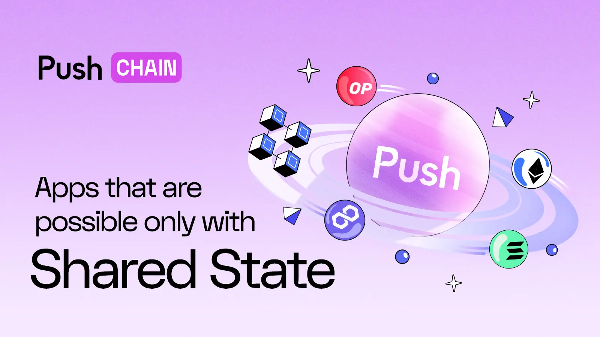
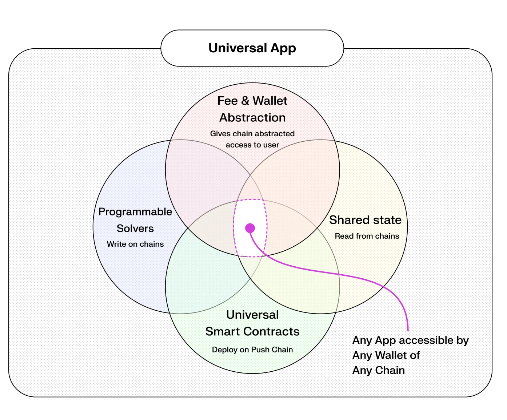
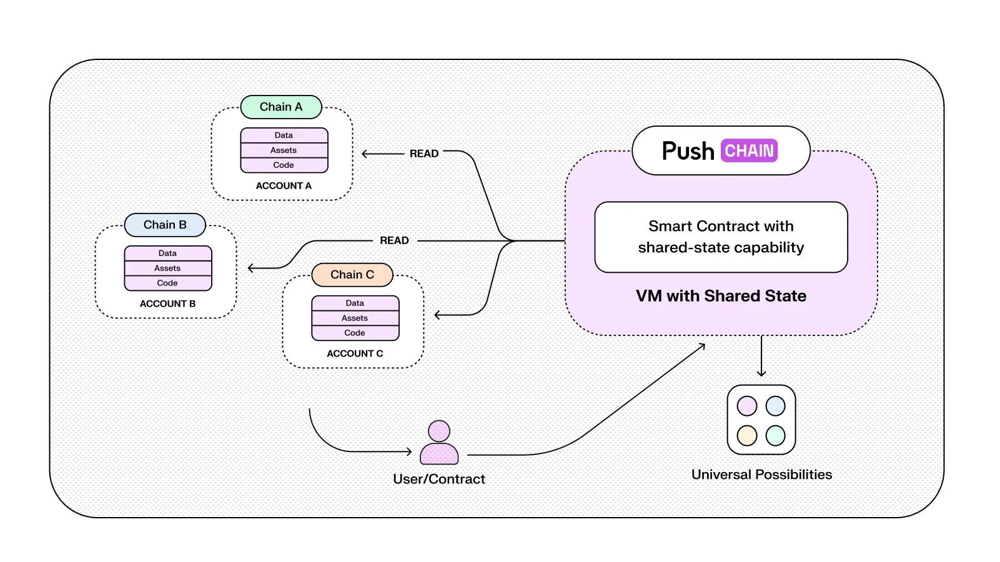
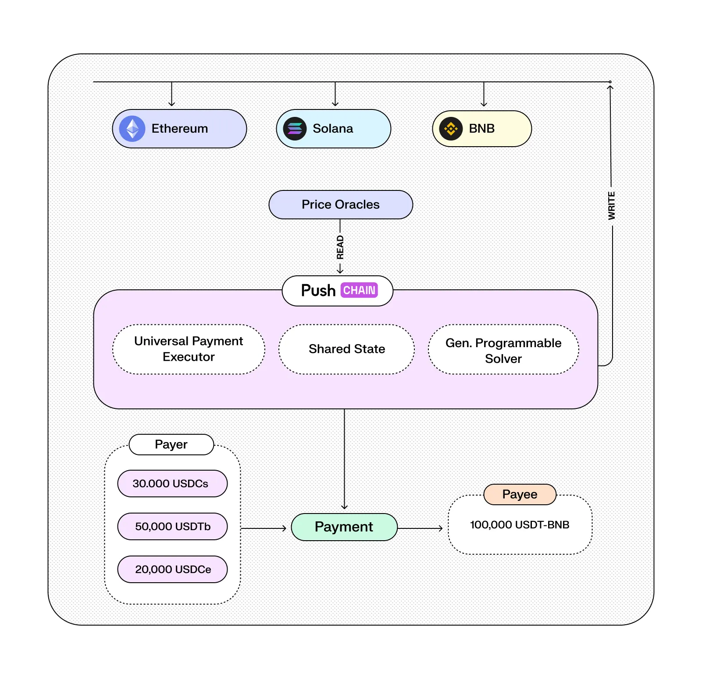
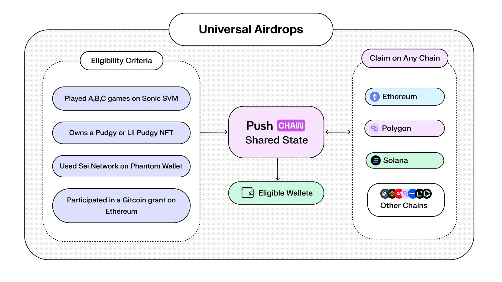

<!--truncate-->

Crypto has come a long way.
And so has the extent of innovations that continue to make this space more adaptive, smooooth and fun!

Here are 5 super innovative use cases the industry could immensely benefit from using Shared State chains like Push Chain.

These use cases cover various bases, including but not limited to Defi, Degen Defi(iykyk), Art, Airdrops, DAOs and even Gaming.

# What is Push Chain?

Push Chain is an all-purpose universal chain that unites every existing and forthcoming chain together (under one roof).

**It is a shared-state L1 blockchain designed to function as a universal app layer for users across any chain, any wallet and any app.**

Combining this with the innovation of cross-chain fees and wallet abstraction, what you get is a **blockchain able to read any other chain and… is accessible by users from any chain.**

# What is a 'shared state' blockchain?

At its core, a blockchain maintains a database tracking the state of all wallets and smart contracts (token balances, data, code, etc.). But these states are siloed within their respective chains, even within the same ecosystem.

For example, a wallet's ETH balance on Ethereum differs from its ETH balance on Base because each of these chains maintains its own state.

For building universal apps we need to:

- **Read** states from other chains (e.g., balances, smart contract data).
- **Write** to all chains, and
- **Support** **wallets** across all networks.

The first of these innovations -- i.e. the ability of developers on Push Chain *to read and utilise the state of other chains* via smart contracts -- is what we mean by a **shared-state blockchain**.

# What kind of apps does this enable? 

## 1. Universal DeFi & Payments

DeFi today is fractured by:
1. chain-bound liquidity, 
2. cumbersome bridging, 
3. and inconsistent pricing. 

Our shared-state model tackles these problems by **unifying access to assets and data across all networks.**

**For example:**

Using cross-chain price oracles, our apps can aggregate real-time ETH/USD rates from Ethereum, Solana and Base, creating a more robust and manipulation-resistant feed. This ensures fair and accurate pricing data for both DeFi and payments.

Similarly, shared-state enables **universal payment executors** that can combine a payee’s balances from different chains, and calculate optimum routes for fulfilling merchant requests irrespective of the chain they’re on.

In the traditional web3 world, if a payee (like a merchant) wants to receive a payment, they usually specify:

- A chain (e.g. “Send to Ethereum”),
- A token (e.g. “Send USDC”), and
- An address (e.g. their ETH address).

**This limits:**

1. Which chain the payer can use.
2. What token they must use.
3. Operational comfort that forces bridging or manual swaps.

### ***What this enables***

- **Stripe-like cross-chain payments:**
    - e.g. payee’s wallet can read real-time asset values from multiple sources and pool them for atomic settlement.

    

    <!-- diagram 2 -->
    <!-- Caption - With Push Chain payer can pool sums from multiple wallets and fulfil the payment in one single transaction. -->

- Seamless cross-chain trades with novel features like:
    - **Collateral management**
        - e.g. a user opens a leveraged position on Solana using ETH as collateral, but he also has some ETH on other chains like Arbitrum and BNB.
        - A shared-state app can read its balances and combine them to create a **unified collateral** **pool,** which can be used across all chains without bridging.
    - **Liquidation protection**
        - e.g. if the ETH price drops by a higher percentage on Solana compared to other chains, a **shared-state liquidation protector** can:
            - Unlock balances on Arbitrum and BNB to balance the trade, and/or
            - Consult other sources (DEXes, oracles etc.) to calculate the average drop and forestall a liquidation event.

### ***Why it needs shared-state***

- Payment routing requires real-time asset and price checks across chains.
- Finding and executing an optimal payment route across payers' wallets from different chains requires reading all the states.
- Collateral managers and liquidation protectors cannot link different balances to the same user without fetching the state.
- Price oracles need to aggregate and verify data from multiple sources.

## 2. Yield Aggregators

Shared-state apps built on Push Chain can also function as **universal yield aggregators**. They can collect and show APYs from various chains, allowing the user to execute the most profitable staking transactions across any network without worrying about native reconversions or swaps.

### ***What this enables***

- Users are no longer tied to a particular blockchain or ecosystem to earn yields on their stablecoins or assets (whether native or foreign). True unchained universal yields.
- Their **aggregated yield routing** enables optimal capital allocation across protocols, minimizing fragmentation and maximizing APY
- **Universal Liquid Staking Tokens** (ULSTs) can be created by combining and/or hybridizing existing ones (e.g. stETH, rETH, mSOL).

### ***Why it needs shared-state***

- Yields are a dynamic function of various on-chain data points (e.g. total staked supply, network inflation rules, validator slashing and reward metrics, gas fees and MEV protections). Their aggregation is impossible without accurate and verifiable cross-chain read capabilities.
- Combined capital and ULSTs require proof of ownership of underlying assets.

## 3. Customizable Universal Exchanges

A customizable universal exchange is one where you can trade any asset (fungible or non-fungible) against any other asset on any chain, with no need for both assets to exist in the same chain.

Currently, ‘trading pairs’ on exchanges are limited to recognized tokens, which have two limitations:

- It adds a permissioning layer (good from a security perspective, but limits censorship resistance);
- In an age where everything is being ‘tokenized’, it is necessary to create permissionless exchanges for customizable trading pairs.

### ***What this enables***

- With shared-state, apps can let users create their own custom exchange options, like an **e-bay for on-chain assets:**
    - e.g. “willing to sell pudgy penguin NFT#44 for 100,000 $SHIB”.
    - Buyers and sellers can be connected through **intent matching games like a cross-chain asset barter system**:
        - e.g. someone ‘willing to sell all his coins on Solana for two popular NFTs on Ethereum’ may be notified of the above trade

### ***Why it needs shared-state***

- Accurate intent matching can occur only when the app has a holistic view of all the assets held by both parties.
- Push Chain’s shared state module allows-
    - Read wallet balances, token IDs, traits, or metadata across chains.
    - Validate offers without bridging or duplicating contracts on other chains.
    - Coordinate solver execution for complex multi-chain settlement.

*Want to experience Universal DEXs?*

*Stay tuned for **Push Chain Testnet V1***

*Coming very soon…*

## 4 Universal Airdrops

Traditionally, Airdrops are localized to a specific chain(Solana, Ethereum, Arbitrum etc). The eligibility checks usually work only within the chain of the drop.

Shared-state chains like Push Chain allow us to query on-chain data from different chains, enabling the flexibility for crafting complex eligibility conditions spanning ecosystems, in a very convenient and unified manner.

***For example:***

**Cross-Chain Game Drop:**

A project launches a new gaming token.

Eligibility conditions:

- Played at least A,B,C games on Sonic SVM,
- Bought a [Pudgy Penguin](https://pudgypenguins.com/) or Lil Pudgy NFT on Ethereum,
- Used Phantom Wallet,
- Participated in a Gitcoin grant on Ethereum.

<!-- Diagram 3 -->

A **universal drop,** in this case, can:

- Verify these diverse activities via shared-state reads.
- Allow claiming the gaming token on Polygon, Solana, or Ethereum - whichever the user prefers.

### ***What this enables***

- Custom cross-chain algorithms for drop eligibility:
    - e.g. filter wallets that have played a game on Arbitrum, participated in Gitcoin Grants via Celo, minted 2 NFTs on Solana and 3 content coins on Zora, over the last year.
- Launching a DeFi app? Design an airdrop for DeFi users across all chains to attract them to your platform.
- Eligibility verifications and claims from any chain to any chain.

### ***Why it needs shared-state***

- Eligibility verification requires **live access** to wallet activity across multiple chains.
- Without shared-state, projects must deploy separate scripts/contracts/oracles per chain, leading to fragmentation, delays, and higher infra costs.

## 5 Universal NFTs

Today’s NFTs are trapped in single-chain ecosystems with rigid formats. (An NFT on Ethereum can’t natively interact with Solana or Aptos.).

It is virtually unheard of to have an NFT on one chain with its tokens on another (although projects such as Pudgy Penguins are pioneering this approach).

Moreover, at present, an NFT can neither be launched on different chains at once, nor can its attributes be natively read from them.

Push Chain redefines NFTs as **dynamic,chain-agnostic digital primitives** - assets whose ownership, metadata, and modes of expression can **live and evolve across multiple chains** simultaneously.

### ***What this enables***

This not only makes them *universal* (i.e.  capable of existing natively on all chains) but also gives them additional cross-chain features such as:

- ***Conditionality**:* the ownership of an asset (or attribute) can be made conditional on custom cross-chain logics, for example:
    - “Dynamically transfer the ownership of this NFT to a wallet on Solana that has the highest degen points on Base.”
    - “If the price of this token reaches 1$ on Cosmos, fractionalize it into 100 pieces and distribute them to wallets with the highest 24 hr trading volume on Aptos.”
- ***Multimodality***: the same NFT can exist as a 2D image on Ethereum, a video on Base, a song on Solana, a narrative on Scroll and a 3D model on Arbitrum.
- ***Organicity***: it can evolve across formats, for example:
    - A digital artwork could start as a static image which could give rise to a community-owned narrative;
    - As this narrative grows, the root image can give rise to distinct animation layers, each with its own set of owners.
- ***Portability***: Ownership of an NFT can act as portable proof across chains.

### ***Why it needs shared-state***

- In order for an NFT to be truly “non-fungible” across chains, the same user (or contract) must be able to provide reliable proofs of ownership from any chain to any chain.
- Reading and writing of NFT metadata across chains.
- Elimination of artificial "chain walls" that restrict creative evolution.

# End Game

Push Chain’s shared-state architecture finally delivers **the universal blockchain trifecta** - unifying user needs, developer needs, and cross-chain data unification - all in a single layer.

For users, it leads to seamless cross-chain interactions: no more juggling bridges, fragmented balances or chain-locked assets. Your entire on-chain identity - DeFi positions, NFTs, agentic memories, game assets etc. becomes portable and composable across all networks.

For developers, shared-state unlocks an entirely new paradigm: universal apps that can natively read and write across all chains as if they were one.

***Seriously..***

***Why build for one chain anymore***

***When you could build for them all?***

# It's not over yet!

We have just scratched the surface.

Vol. 2 of this article will be even more mind-bending, covering use cases across AI agents, DAOs, Gaming and much more!

Stay Tuned!

## Next Steps

- Follow [@PushChain on X](https://x.com/PushChain) to get the latest updates about Push Chain
- Want to build on Push Chain? Explore the docs and example snippets here → [Push Chain Docs](https://push.org/docs/chain/)
- Visit the [Push Chain](https://push.org/chain?utm_source=pushblog&utm_medium=referral&utm_campaign=pcgov) Litepaper to find a one-pager explanation of the vision.
- [Push Chain Devnet](https://scan.push.org/?utm_source=pushblog&utm_medium=referral&utm_campaign=pcgov) is running live on Proof-of-Stake network validators, storage and archival nodes. The network already supports consumer transactions as well.