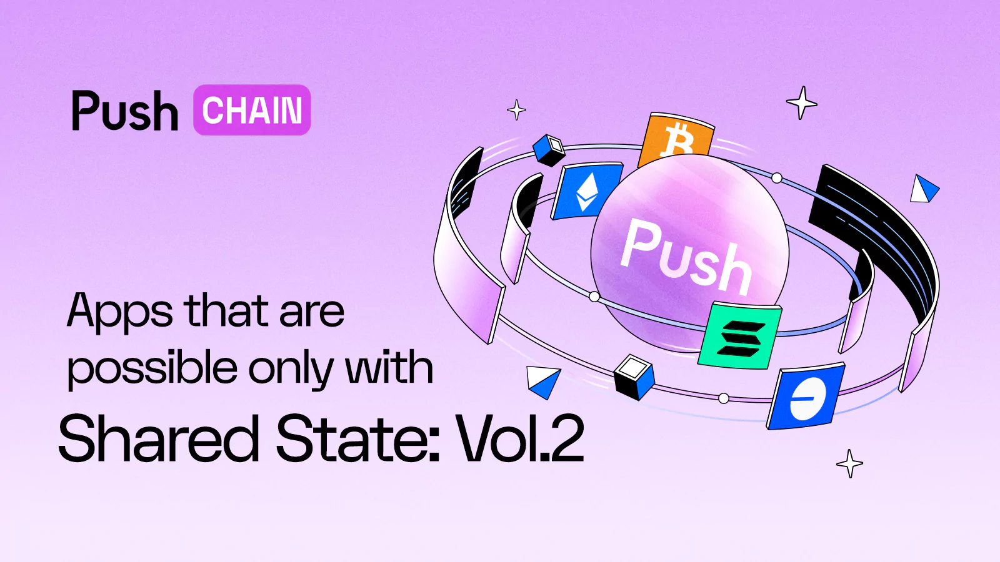

<!--truncate-->

Welcome to the 2nd Volume of  - Apps that are only possible with Push Chain’s shared state architecture!

In the [previous edition](https://push.org/blog/apps-only-possible-with-shared-state-v1/), we covered use cases spanning Defi, cross chain yields, universal airdrops and NFTs that can only be possible using capabilities that chains like Push Chain provide.

🚨SPOILER ALERT - You might be able to see some of them in Testnet V1!Stay tuned!

In this iteration, we will amp up the utility scale and explore few of the most popular areas - loved by both - devs & users.

Before we begin, if you’re new to the concept of Shared Sates and Push Chain, here’s a quick recap:
Feel free to skip down to the use cases section if you’re already aware of these concepts.

## What is Push Chain? - Super Quick Recap:
Push Chain is an all-purpose universal chain that unites every existing and forthcoming chain together (under one roof).

<b>It is a shared-state L1 blockchain designed to function as a universal app layer for users across any chain, any wallet and any app.</b>

Combining this with the innovation of cross-chain fees and wallet abstraction, what you get is a blockchain able to read any other chain and… is accessible by users from any chain.

## What is a 'shared state' blockchain?

At its core, a blockchain maintains a database tracking the state of all wallets and smart contracts (token balances, data, code, etc.). But these states are siloed within their respective chains, even <i>within the same ecosystem.</i>

For example, a wallet's ETH balance on Ethereum differs from its ETH balance on Base because each of these chains maintains its own state.

For building universal apps we need to:
- <b>Read</b> states from other chains (e.g., balances, smart contract data).
- <b>Write</b> to all chains, and
- <b>Support wallets</b> across all networks.

The first of these innovations -- i.e. the ability of developers on Push Chain <i>to read and utilise the state of other chains via smart contracts</i> -- is what we mean by a <b>shared-state blockchain.</b>

## Apps that are only possible with Shared States:
### 1) Competitive Cross Chain Gaming

<b>Shared-state makes ‘chain wars’ real!</b>
It allows players from any blockchain ecosystem to come together and play their favourite games with (or against) each other by leveraging Push Chain as a shared settlement layer.

Think ‘[Universal Chess](https://chess.push.org)’ tournaments between Ethereum and Solana tribes, with a cross-chain betting widget for viewers and game NFTs for players. The perfect degen chess experience!

But it doesn’t stop there. Think Poker, Blackjack, Monopoly, RPGs and more, available to and accessible by users of all chains!

By removing the biggest barriers to on-chain game adoption, i.e. UX and asset fragmentation, <b>Push Chain allows gamers to bring their chain-specific identities to chain-neutral playgrounds.</b>

#### 🌌What this enables:
- Game developers can design experiences for the entire web3 userbase.
- Chain agnostic user onboarding - users can join from any chain they already use.
- <b>Unified cross-chain identities</b>: Users can pause/save a game on one chain, and continue from the same checkpoint on another chain.
 e.g., Player 2 moves to Arbitrum but keeps their character's skills and assets intact.
- Multiplayer games can allow users to join from any chain, or switch in the middle without losing access to their points and/or in-game assets.

#### 🤔Why it needs shared state:
- Chain-neutral playgrounds require seamless state synchronizations, player state to be unified in one trusted environment - in order to track individual as well as relational game data (points, damage, skills, assets etc.).
- Without shared-state, cross-chain games would need <b>custom bridges</b> and complex game synchronization measures per game, which would be expensive and damaging for the UX.

### 2) Multichain DAOs
Protocol tokens are increasingly becoming available cross-chain. For example, Uniswap’s UNI exists on Ethereum, Polygon and Base among others. <b>With shared-state, apps can aggregate a member’s voting power across chains by reading and bundling his tokens.</b>

#### 🌌 What this enables:
- DAOs can launch tokens <b>across multiple chains</b> without fracturing governance.
- The community can participate in decentralized decision-making through <b>cross-chain coordination</b> (e.g. delegated votes, comments on proposals, commitment pools, temperature checks etc.)

#### 🤔Why it needs shared-state:
- ‘Voting power’ is a combined function of a protocol’s real and synthetic assets held across chains.

### 3) Universal AI Agents:

Shared state capabilities of Push Chain act as the missing coordination layer for enabling universal AI agents to operate across multiple independent chains autonomously, reliably, and with a unified memory.

#### 🌌What this enables:
Build <b>chain-agnostic AI agents</b> that can:
- Read user states, assets, activities, and preferences across all chains.
- Act on behalf of users without needing users to bridge, switch wallets, or manually interact with dApps.
- Maintains a <b>persistent universal context</b> across chains, apps, and experiences.

<b>Ex: Personal Finance Assistant Agent:</b>

- Reads the user's balances across Ethereum, Arbitrum, Optimism, and Solana.
- Notices idle assets on Base and recommends moving them into a higher-yield protocol on Polygon.
- Automatically constructs and <b>executes a cross-chain investment action</b> via Push Chain's programmable solvers.

#### 🤔Why it needs shared-state:
- Unified State Access: AI agents need real-time visibility into user balances, transactions, and positions <b>across all chains.</b>

### 4) Universal (Multi-chain) Safes
Today, managing assets across multiple chains is a logistical nightmare.

Users must juggle separate wallets, track balances individually, and manually bridge funds — a process that’s both error-prone and inefficient. While ‘safes’ are a reliable way for groups to pool and manage assets (e.g. for DAOs, investment clubs, or even families), they face additional challenges due to multisig barriers.

Shared-state solves this by enabling <b>safes with multi-chain signers</b>, i.e. chain-agnostic vaults that can natively pool, manage and utilise assets across all chains.

This turns the chaos of fragmented assets into a streamlined, interoperable system — for individuals, DAOs, and institutions. With shared-state, Push Chain makes cross-chain asset-management as simple as using a single shared wallet.

#### 🌌 What it enables:

##### Unified Asset Management
- Users can deposit assets from any chain (e.g., ETH on Ethereum, SOL on Solana, GNO on Gnosis) into a single safe, with real-time visibility of their total portfolio.
- Groups (DAOs, hedge funds, guilds) can collectively manage cross-chain treasuries without requiring manual bridging or chain-specific multisigs.

##### Conditional Cross-Chain Spending
- Define rules like: "Allow withdrawals only if 3/5 signers approve, and only up to 10% of the safe's TVA (Total Value Across chains)."
- Automate cross-chain rebalancing (e.g., "If $CLANKER on Base drops below 20% of the safe's TVA, sell $TRUMP on Solana to equalize").

##### Shared Ownership Without Bridging
- A DAO can hold ETH on Ethereum, stSOL on Solana, and USDC on Base — all in the same safe, governed by the same rules.
- Families or investment clubs can pool assets across chains while maintaining granular permissions (e.g., "Kids can only spend from the Optimism portion").

##### Cross-Chain Inheritance & Recovery
- Set up programmable inheritance (e.g., "If inactive for 12 months, transfer all assets — regardless of chain — to this backup wallet").
- Social recovery mechanisms can pull verification from multiple chains (e.g., "Recover safe if 5/7 friends from Ethereum, Solana, and Polygon sign").

#### Why it needs shared-state:
##### Real-Time Portfolio Tracking
- A safe’s TVA (Total Value Across chains) can only be calculated if the contract can read balances from all connected chains.
- Without shared-state, we’d need to manually bridge assets to a single chain—defeating the purpose of a true ‘multi-chain’ safe.

##### Cross-Chain Transaction Execution
- Spending from a multi-chain safe requires verifying ownership and permissions across chains (e.g., "Does this wallet have approval on Ethereum to trigger a withdrawal on Solana?").
- Shared-state enables this via atomic cross-chain actions (e.g., selling ETH on Arbitrum to buy SOL on Solana in one transaction).

##### Dynamic Rule Enforcement
- Conditions like "Only spend if the safe’s total stablecoin holdings exceed $1M" require aggregating balances from multiple chains.
- Recovery mechanisms need to verify on-chain activity (e.g., "Check last transaction timestamps on all chains before triggering inheritance").

### 5) Embeddable Prediction Markets

Prediction markets are great tools for building alignment, coordination and conviction within groups. They can unlock a bunch of utility when combined with other on-chain activities such as DeFi, voting, gaming and content creation.

Today, however, they operate as isolated betting shops which are limited to specific chains, acceptable tokens and capacity to verify events (off or on-chain).

<b>Shared-state changes all of this.</b>

Push Chain enables <b>universally embeddable prediction markets</b> that can be attached to any cross-chain app, game, or event and can be used by users from any chain and any token.

Seamless routing liquidity across chains, without bridging.

Thus, turning fragmented cross-chain activities into a unified playground for probabilistic thinking.

#### 🌌What this enables:
##### App-based prediction widgets: developers can create internal markets that can be attached to any cross-chain app, game, or events:
- e.g.: during a board/card game on one chain, a widget allows viewers from any chain to create ‘internal bets’:
a. on the outcome of the game,
b. on specific moves/cards,

##### Event-driven derivatives: time-sensitive markets that spin up whenever certain conditions are met:
- e.g. for the duration of Trump’s golf game, will the price of $Trump rise or fall? (Such a market can be programmed to spin up automatically on credible news of Trump playing golf, and disappear when the game ends).

##### Deeper community engagement: Local prediction markets embedded in apps = high engagement attraction.

<b>🤔Why it needs shared-state:</b>
- Markets must read real-time data from multiple chains (DEX volumes, social data, oracles).
- <b>Cross-chain settlement proofs</b> are required to resolve outcomes trustlessly.
- Dynamic odds calculation requires unified liquidity across all prediction pools.

## End Game

Push Chain’s shared-state architecture finally delivers <b>the universal blockchain trifecta</b> — unifying user needs, developer needs, and cross-chain data unification – all in a single layer.

For users, it leads to seamless cross-chain interactions: no more juggling bridges, fragmented balances or chain-locked assets. Your entire on-chain identity — DeFi positions, NFTs, agentic memories, game assets etc. — becomes portable and composable across all networks.

For developers, shared-state unlocks an entirely new paradigm: read and unify fragmented assets without worrying about latency, cost, security or interoperability.

<b>
Seriously..  
Why build for one chain  
When you could build for them all?  
</b>
