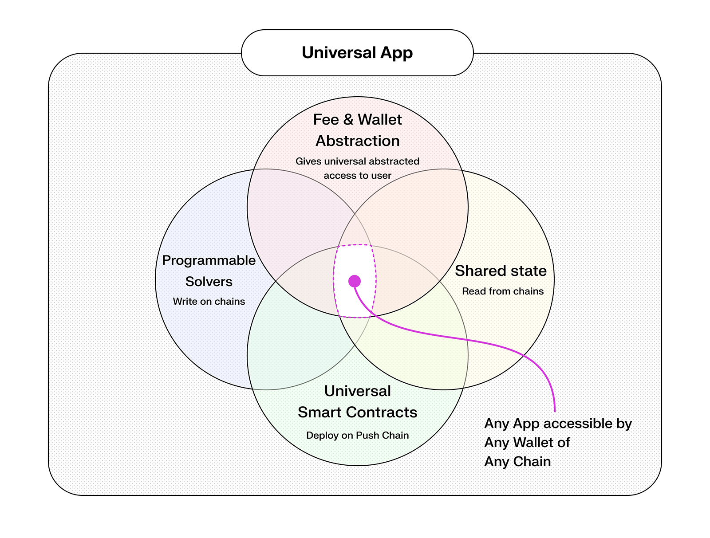
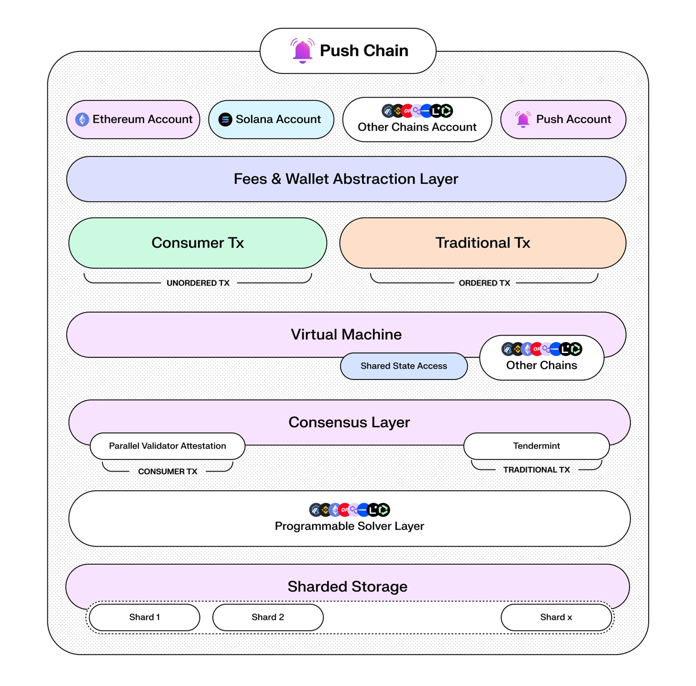

# Intro to Push Chain

Push Chain is a True Universal Layer 1 Proof of Stake (PoS) blockchain enabling universal applications with seamless interoperability, user-friendly wallet abstractions, and robust shared state architecture.

<head>
  <title>Introduction | Push Chain | Push Documentation</title>
</head>

import {
  ModalContainer,
  ModalSmall,
  AImp,
  ModalWrapper,
  ModalMidEqual,
} from '@site/src/css/SharedStyling';

## What is a True Universal Layer 1?

A True Universal Layer 1 blockchain like Push Chain is designed to abstract away the complexity of blockchain fragmentation. Instead of focusing on chain-specific deployment, developers can create universal apps that are accessible by any wallet, regardless of the originating chain. Push Chain accomplishes this through a shared state architecture, enabling apps to read from and write to various chains, while maintaining a unified user experience. This architecture is illustrated on diagram below.

## Why Push Chain?

Push Chain focuses on consumer-centric, universal applications, delivering seamless UX, scalability, and simplified interactions across multiple blockchain ecosystems. Push Chain uniquely enables:

- **Empowering Universal Applications**: Supports seamless integration of financial (DeFi) and non-financial use cases.
- **Wallet Interactions Made Easy**: Users can seamlessly interact using their existing wallets without needing a new Push Wallet.
- **Fee and Wallet Abstraction**: Fees can be paid in native tokens or handled by applications, removing friction for users.
- **Unified User Identity (Push ID)**: Consolidates multiple wallet interactions into one user identity.
- **Comprehensive Wallet Abstraction**: Simplifies onboarding for Web3 enthusiasts, newcomers, and traditional Web2 users.

## How Push Chain works?

Push Chain architecture is composed of modular layers, each responsible for enabling the key primitives required for universal applications. As described in the [Push Chain Litepaper](https://push.org/litepaper.pdf), the architecture includes wallet and fee abstraction, shared state access across multiple chains, a programmable solver layer, and a consensus system that supports both traditional and consumer transactions. These layers collectively power universal apps that are accessible from any wallet on any chain, as shown below.

## SDKs

<ModalContainer>
  <ModalSmall
    onClick={() =>
      window.open('https://github.com/push-protocol/push-chain-sdk', '_blank')
    }
  >
    
    <ModalWrapper>
    
      Javascript
      <svg
        width='20'
        height='28'
        viewBox='0 0 29 28'
        fill='none'
        xmlns='http://www.w3.org/2000/svg'
      >
        <path
          d='m7.501 21.001 14-14M10.125 7.001H21.5v11.375'
          stroke='#A0A3B1'
          stroke-width='2'
          stroke-linecap='round'
          stroke-linejoin='round'
        ></path>
      </svg>
    
    </ModalWrapper>
  </ModalSmall>

  <ModalSmall
  onClick={() =>
    window.open('https://github.com/push-protocol/push-chain-sdk', '_blank')
  }
>
  
  <ModalWrapper>
    
      React
      <svg
        width='20'
        height='28'
        viewBox='0 0 29 28'
        fill='none'
        xmlns='http://www.w3.org/2000/svg'
      >
        <path
          d='m7.501 21.001 14-14M10.125 7.001H21.5v11.375'
          stroke='#A0A3B1'
          stroke-width='2'
          stroke-linecap='round'
          stroke-linejoin='round'
        ></path>
      </svg>
    
  </ModalWrapper>
</ModalSmall>

<ModalSmall
  onClick={() =>
    window.open('https://github.com/push-protocol/push-chain-sdk', '_blank')
  }
>
  
  <ModalWrapper>
    
      React Native
      <svg
        width='20'
        height='28'
        viewBox='0 0 29 28'
        fill='none'
        xmlns='http://www.w3.org/2000/svg'
      >
        <path
          d='m7.501 21.001 14-14M10.125 7.001H21.5v11.375'
          stroke='#A0A3B1'
          stroke-width='2'
          stroke-linecap='round'
          stroke-linejoin='round'
        ></path>
      </svg>
    
  </ModalWrapper>
</ModalSmall>

</ModalContainer>

## Use Cases

<ModalContainer>
  <ModalSmall onClick={() => window.open('/docs/chain/use-cases/#6-universal-marketplaces', '_self')}>
    
    DeFi
  </ModalSmall>

  <ModalSmall onClick={() => window.open('/docs/chain/use-cases/#5-utility-and-productivity-apps', '_self')}>
    
    Universal App Experience
  </ModalSmall>

  <ModalSmall onClick={() => window.open('/docs/chain/use-cases/#3-gaming-applications', '_self')}>
    
    Gaming
  </ModalSmall>

  <ModalSmall onClick={() => window.open('/docs/chain/use-cases/#4-ai-powered-applications', '_self')}>
    
    AI
  </ModalSmall>

  <ModalSmall onClick={() => window.open('/docs/chain/use-cases/#1-decentralized-social-platforms', '_self')}>
    
    Social
  </ModalSmall>

</ModalContainer>

## Try Push Chain

Experience Push Chain firsthand:

1. Visit [simulate.push.org](https://simulate.push.org) to interact directly. You can log in with your existing wallet, email, or even your social accounts, and send a transaction on Push Chain with just a few clicks.
2. Alternatively, use our Playground to experiment with code and see live updates within our documentation.
3. Learn more about Push Chain fundamentals, deep dives, and developer resources in our comprehensive [Knowledge Base](https://push.org/knowledge).
