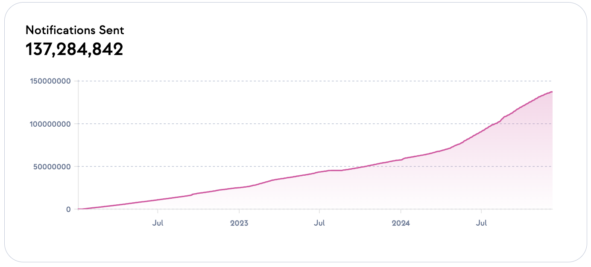

# Intro to Push Chain

Push Chain is a Proof of Stake (PoS) layer 1 blockchain network designed to revolutionize web3 by addressing scalability, interoperability, and user experience challenges. With a roadmap spanning three phases, Push Chain aims to empower developers to create universal applications that blend financial and non-financial use cases, making blockchain accessible to everyone.

<head>
  <title>Introduction | Push Chain | Push Documentation</title>
</head>

## Push Chain Vision and Mission

**Vision**: To create a world where web3 applications deliver seamless user experiences akin to web2 apps, while retaining blockchain's core values—censorship resistance, permissionlessness, and security.

**Mission**: Push Chain provides the infrastructure to achieve true scalability and universal accessibility, enabling developers to build applications that transcend blockchain-specific constraints.

## The Evolution of Push Protocol

Push Protocol, the leading communication layer in web3, set a new standard for decentralized communication by introducing real-time notifications and chat. Trusted by major platforms such as Uniswap, ENS, and Decentraland, it has delivered over 130 million notifications, significantly enhancing user experiences and advancing adoption across the ecosystem.

While Push Protocol excelled in communications, web3’s broader challenges—scalability, fragmented ecosystems, and limited consumer adoption—demanded an innovative solution. This inspired the creation of Push Chain, a universal blockchain designed to address these issues and unlock new possibilities for Web3.

import {
  ModalContainer,
  ModalSmall,
  ModalWrapper,
  ModalMidEqual,
} from '@site/src/css/SharedStyling';

## Why Push Chain?

Push Chain prioritizes consumer-centric applications, offering seamless UX, true scalability, and simplified interactions—unlike finance-focused blockchains. Features like parallel block execution and dynamic sharding enable high performance and ease of use.

### Consumer Applications 

Push Chain empowers developers to build a new generation of consumer applications, blending financial and non-financial use cases in ways never before possible. By enabling shared state across chains, Push Chain lets apps seamlessly access data and execute transactions on multiple blockchains. This innovation removes the barriers of isolated ecosystems, enabling entirely new application types that leverage cross-chain functionality.

### Seamless Wallet Interactions

Push Chain allows users to interact directly with the blockchain using their existing wallets from any chain. There’s no need to create a Push Wallet, making it effortless for users to participate without leaving their current ecosystems or learning new tools.

### Fee Abstraction for Improved UX

With fees abstracted away, users can pay transaction costs in the native tokens of their existing blockchain or have the application cover the costs entirely. This significantly reduces friction and creates a user-friendly experience that matches traditional web applications.

### Unified User Identity (Push ID) 

Push ID simplifies multi-chain interactions by linking multiple EVM and non-EVM wallets under a single identifier. It provides a unified view of assets and activities across blockchains, enhancing user experience and enabling seamless cross-chain functionality for both users and developers.

### Comprehensive Wallet Abstraction

Push Chain caters to three user types:
  1. **Experienced web3 Users**: Users can continue using their existing wallets and interact with Push Chain directly, avoiding any additional onboarding steps.
  2. **Web3 Newcomers**: For those new to the ecosystem, Push Chain supports email and social logins, enabling a familiar and secure onboarding process.
  3. **Web2 Users**: Push Chain bridges the gap for users unfamiliar with web3, ensuring they can access applications with minimal barriers while gradually introducing them to decentralized technologies.

## Roadmap: Phases of Push Chain Development

Push Chain's development is structured into three phases:

1. **Phase 1: Consumer-Centric Apps**
   - Features like wallet abstraction, fee abstraction, parallel block execution, and consumer transactions for seamless scalability and user onboarding.
   - Applications optimized for non-financial use cases and mixed financial apps.

2. **Phase 2: Seamless Interoperability**
   - Cross-chain messaging and smart contract bridging for unified app experiences.
   - Arbitrary payload transfers across multiple chains.

3. **Phase 3: Universal Apps and Shared State**
   - Enabling shared state and universal smart contracts for applications that interact across all chains seamlessly.

## SDKs

<ModalContainer>
  <ModalSmall
    onClick={() =>
      window.open('https://github.com/push-protocol/push-chain-sdk', '_blank')
    }
  >
    
    <ModalWrapper>
    
      Javascript
      <svg
        width='20'
        height='28'
        viewBox='0 0 29 28'
        fill='none'
        xmlns='http://www.w3.org/2000/svg'
      >
        <path
          d='m7.501 21.001 14-14M10.125 7.001H21.5v11.375'
          stroke='#A0A3B1'
          stroke-width='2'
          stroke-linecap='round'
          stroke-linejoin='round'
        ></path>
      </svg>
    
    </ModalWrapper>
  </ModalSmall>
</ModalContainer>

## Universal applications with Push

Push was started from [ETHGlobal 2020](https://ethglobal.com/) and have pioneered the web3 notification and communication era which we believe is crucial to take Web3 to a billion users. Though, hundreds of integration/partners/collaborators of Push are the real heroes here —

<ModalContainer>

  <ModalMidEqual
    flexDirection='column'
    maxWidth='200px'
    onClick={() =>
      window.open(
        'https://snaps.metamask.io/snap/npm/pushprotocol/snap/',
        '_blank'
      )
    }
  >
    
    <ModalWrapper>
    
      Metamask Push Snap
      <svg
        width='20'
        height='28'
        viewBox='0 0 29 28'
        fill='none'
        xmlns='http://www.w3.org/2000/svg'
      >
        <path
          d='m7.501 21.001 14-14M10.125 7.001H21.5v11.375'
          stroke='#A0A3B1'
          stroke-width='2'
          stroke-linecap='round'
          stroke-linejoin='round'
        ></path>
      </svg>
    
    </ModalWrapper>
  </ModalMidEqual>

  <ModalMidEqual
    flexDirection='column'
    onClick={() => window.open('https://unstoppabledomains.com/', '_blank')}
  >
    
    <ModalWrapper>
    
      Unstoppable Domains
      <svg
        width='20'
        height='28'
        viewBox='0 0 29 28'
        fill='none'
        xmlns='http://www.w3.org/2000/svg'
      >
        <path
          d='m7.501 21.001 14-14M10.125 7.001H21.5v11.375'
          stroke='#A0A3B1'
          stroke-width='2'
          stroke-linecap='round'
          stroke-linejoin='round'
        ></path>
      </svg>
    
    </ModalWrapper>
  </ModalMidEqual>

  <ModalMidEqual
    flexDirection='column'
    onClick={() =>
      window.open(
        'https://app.push.org/channels?channel=0x97E5271f2987c7A3450e21dD7FFe4D004ddE773E',
        '_blank'
      )
    }
  >
    
    <ModalWrapper>
    
      Uniswap
      <svg
        width='20'
        height='28'
        viewBox='0 0 29 28'
        fill='none'
        xmlns='http://www.w3.org/2000/svg'
      >
        <path
          d='m7.501 21.001 14-14M10.125 7.001H21.5v11.375'
          stroke='#A0A3B1'
          stroke-width='2'
          stroke-linecap='round'
          stroke-linejoin='round'
        ></path>
      </svg>
    
    </ModalWrapper>
  </ModalMidEqual>

  <ModalMidEqual
    flexDirection='column'
    maxWidth='200px'
    onClick={() =>
      window.open(
        'https://app.push.org/channels?channel=0x19A6C52bd08898F8Ee5c6ba3FB67AFd184be8034',
        '_blank'
      )
    }
  >
    
    <ModalWrapper>
    
      Polygon
      <svg
        width='20'
        height='28'
        viewBox='0 0 29 28'
        fill='none'
        xmlns='http://www.w3.org/2000/svg'
      >
        <path
          d='m7.501 21.001 14-14M10.125 7.001H21.5v11.375'
          stroke='#A0A3B1'
          stroke-width='2'
          stroke-linecap='round'
          stroke-linejoin='round'
        ></path>
      </svg>
    
    </ModalWrapper>
  </ModalMidEqual>

  <ModalMidEqual
    flexDirection='column'
    maxWidth='200px'
    onClick={() =>
      window.open(
        'https://app.push.org/channels?channel=0x4E15B14B9950A04370E36f2Ec05546ED5867ADeF',
        '_blank'
      )
    }
  >
    
    <ModalWrapper>
    
      Bankless
      <svg
        width='20'
        height='28'
        viewBox='0 0 29 28'
        fill='none'
        xmlns='http://www.w3.org/2000/svg'
      >
        <path
          d='m7.501 21.001 14-14M10.125 7.001H21.5v11.375'
          stroke='#A0A3B1'
          stroke-width='2'
          stroke-linecap='round'
          stroke-linejoin='round'
        ></path>
      </svg>
    
    </ModalWrapper>
  </ModalMidEqual>

  <ModalMidEqual
    flexDirection='column'
    maxWidth='200px'
    onClick={() =>
      window.open(
        'https://app.push.org/channels?channel=0x1a9dDEf485674fC60a269cf97FAbc6b8728A3497',
        '_blank'
      )
    }
  >
    
    <ModalWrapper>
    
      1Inch
      <svg
        width='20'
        height='28'
        viewBox='0 0 29 28'
        fill='none'
        xmlns='http://www.w3.org/2000/svg'
      >
        <path
          d='m7.501 21.001 14-14M10.125 7.001H21.5v11.375'
          stroke='#A0A3B1'
          stroke-width='2'
          stroke-linecap='round'
          stroke-linejoin='round'
        ></path>
      </svg>
    
    </ModalWrapper>
  </ModalMidEqual>

  <ModalMidEqual
    flexDirection='column'
    maxWidth='200px'
    onClick={() =>
      window.open(
        'https://app.push.org/channels?channel=0x90A48D5CF7343B08dA12E067680B4C6dbfE551Be',
        '_blank'
      )
    }
  >
    
    <ModalWrapper>
    
      Shapeshift
      <svg
        width='20'
        height='28'
        viewBox='0 0 29 28'
        fill='none'
        xmlns='http://www.w3.org/2000/svg'
      >
        <path
          d='m7.501 21.001 14-14M10.125 7.001H21.5v11.375'
          stroke='#A0A3B1'
          stroke-width='2'
          stroke-linecap='round'
          stroke-linejoin='round'
        ></path>
      </svg>
    
    </ModalWrapper>
  </ModalMidEqual>

  <ModalMidEqual
    flexDirection='column'
    maxWidth='200px'
    onClick={() =>
      window.open(
        'https://twitter.com/Nata_Social/status/1696960093336514764',
        '_blank'
      )
    }
  >
    
    <ModalWrapper>
    
      Nata Social
      <svg
        width='20'
        height='28'
        viewBox='0 0 29 28'
        fill='none'
        xmlns='http://www.w3.org/2000/svg'
      >
        <path
          d='m7.501 21.001 14-14M10.125 7.001H21.5v11.375'
          stroke='#A0A3B1'
          stroke-width='2'
          stroke-linecap='round'
          stroke-linejoin='round'
        ></path>
      </svg>
    
    </ModalWrapper>
  </ModalMidEqual>

  <ModalMidEqual
    flexDirection='column'
    maxWidth='200px'
    onClick={() =>
      window.open(
        'https://app.push.org/channels?channel=0xaf962c18538A6498AcC9980b3Da74E0D9A131eBa',
        '_blank'
      )
    }
  >
    
    <ModalWrapper>
    
      Aragon
      <svg
        width='20'
        height='28'
        viewBox='0 0 29 28'
        fill='none'
        xmlns='http://www.w3.org/2000/svg'
      >
        <path
          d='m7.501 21.001 14-14M10.125 7.001H21.5v11.375'
          stroke='#A0A3B1'
          stroke-width='2'
          stroke-linecap='round'
          stroke-linejoin='round'
        ></path>
      </svg>
    
    </ModalWrapper>
  </ModalMidEqual>

  <ModalMidEqual
    flexDirection='column'
    maxWidth='200px'
    onClick={() =>
      window.open(
        'https://app.push.org/channels?channel=0xBCAc4dafB7e215f2F6cb3312aF6D5e4F9d9E7eDA',
        '_blank'
      )
    }
  >
    
    <ModalWrapper>
    
      Decentraland
      <svg
        width='20'
        height='28'
        viewBox='0 0 29 28'
        fill='none'
        xmlns='http://www.w3.org/2000/svg'
      >
        <path
          d='m7.501 21.001 14-14M10.125 7.001H21.5v11.375'
          stroke='#A0A3B1'
          stroke-width='2'
          stroke-linecap='round'
          stroke-linejoin='round'
        ></path>
      </svg>
    
    </ModalWrapper>
  </ModalMidEqual>

  <ModalMidEqual
    flexDirection='column'
    maxWidth='200px'
    onClick={() =>
      window.open(
        'https://app.push.org/channels?channel=0xe56f1D3EDFFF1f25855aEF744caFE7991c224FFF',
        '_blank'
      )
    }
  >
    
    <ModalWrapper>
    
      Coindesk
      <svg
        width='20'
        height='28'
        viewBox='0 0 29 28'
        fill='none'
        xmlns='http://www.w3.org/2000/svg'
      >
        <path
          d='m7.501 21.001 14-14M10.125 7.001H21.5v11.375'
          stroke='#A0A3B1'
          stroke-width='2'
          stroke-linecap='round'
          stroke-linejoin='round'
        ></path>
      </svg>
    
    </ModalWrapper>
  </ModalMidEqual>

  <ModalMidEqual
    flexDirection='column'
    maxWidth='200px'
    onClick={() =>
      window.open(
        'https://app.push.org/channels?channel=0x23c6b8fB0557FD5e6696BceF3fD4855E0d7018C0',
        '_blank'
      )
    }
  >
    
    <ModalWrapper>
    
      DyDx
      <svg
        width='20'
        height='28'
        viewBox='0 0 29 28'
        fill='none'
        xmlns='http://www.w3.org/2000/svg'
      >
        <path
          d='m7.501 21.001 14-14M10.125 7.001H21.5v11.375'
          stroke='#A0A3B1'
          stroke-width='2'
          stroke-linecap='round'
          stroke-linejoin='round'
        ></path>
      </svg>
    
    </ModalWrapper>
  </ModalMidEqual>

  <ModalMidEqual
    flexDirection='column'
    maxWidth='200px'
    onClick={() =>
      window.open(
        'https://app.push.org/channels?channel=0x26C8C84adDA6dbA89E93f139D48c0E39B3a6A8fF',
        '_blank'
      )
    }
  >
    
    <ModalWrapper>
    
      Arbitrum
      <svg
        width='20'
        height='28'
        viewBox='0 0 29 28'
        fill='none'
        xmlns='http://www.w3.org/2000/svg'
      >
        <path
          d='m7.501 21.001 14-14M10.125 7.001H21.5v11.375'
          stroke='#A0A3B1'
          stroke-width='2'
          stroke-linecap='round'
          stroke-linejoin='round'
        ></path>
      </svg>
    
    </ModalWrapper>
  </ModalMidEqual>

  <ModalMidEqual
    flexDirection='column'
    maxWidth='200px'
    onClick={() =>
      window.open(
        'https://app.push.org/channels?channel=0x8C28Cf33d9Fd3D0293f963b1cd27e3FF422B425c',
        '_blank'
      )
    }
  >
    
    <ModalWrapper>
    
      Snapshot
      <svg
        width='20'
        height='28'
        viewBox='0 0 29 28'
        fill='none'
        xmlns='http://www.w3.org/2000/svg'
      >
        <path
          d='m7.501 21.001 14-14M10.125 7.001H21.5v11.375'
          stroke='#A0A3B1'
          stroke-width='2'
          stroke-linecap='round'
          stroke-linejoin='round'
        ></path>
      </svg>
    
    </ModalWrapper>
  </ModalMidEqual>

  <ModalMidEqual
    flexDirection='column'
    maxWidth='200px'
    onClick={() => window.open('https://push.org/frens', '_blank')}
  >
    
    <ModalWrapper>
    
      Explore All
      <svg
        width='20'
        height='28'
        viewBox='0 0 29 28'
        fill='none'
        xmlns='http://www.w3.org/2000/svg'
      >
        <path
          d='m7.501 21.001 14-14M10.125 7.001H21.5v11.375'
          stroke='#A0A3B1'
          stroke-width='2'
          stroke-linecap='round'
          stroke-linejoin='round'
        ></path>
      </svg>
    
    </ModalWrapper>
  </ModalMidEqual>

</ModalContainer>
