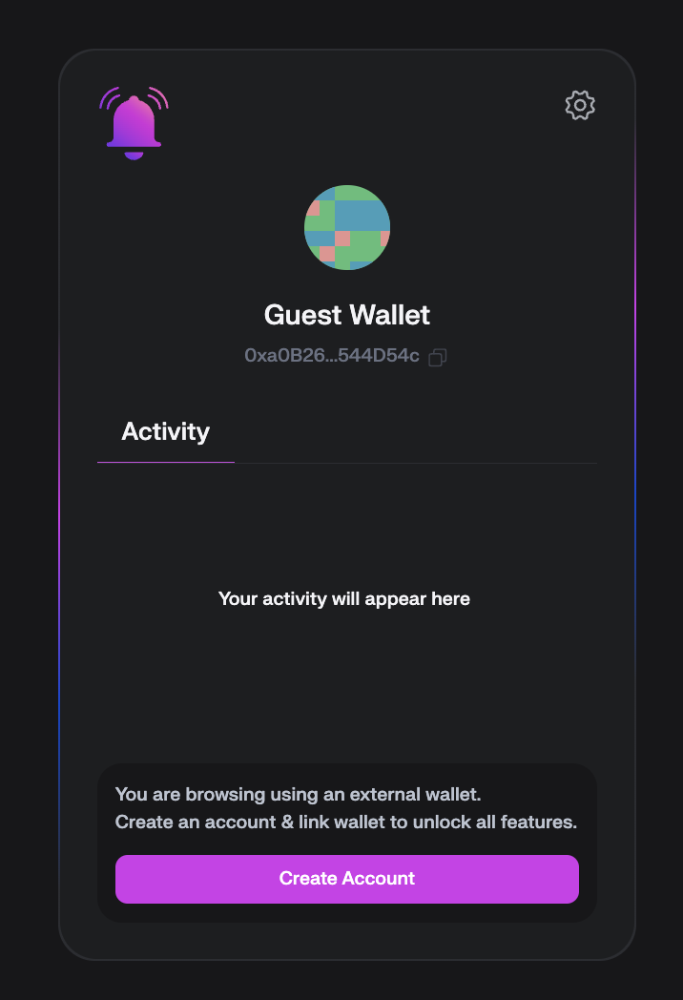
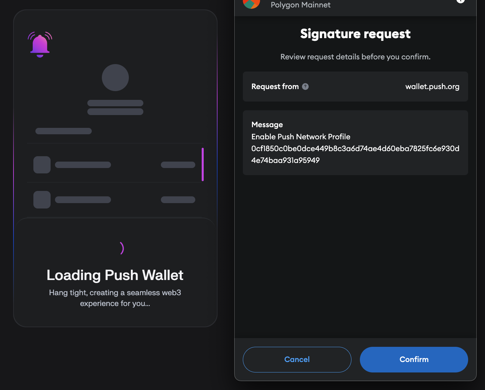
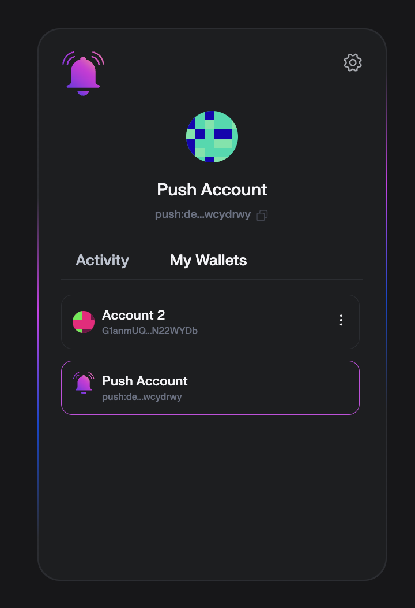

# Wallet Absctraction

This section covers the `connect` function of the Push Wallet SDK and the technical advantages it brings to developers and users.

<head>
  <title>{`Push Wallet Connect | Push Chain | Push Documentation`}</title>
</head>

## Connect to Push Wallet

The `connect` function allows seamless integration of a user's wallet with your DApp, leveraging decentralized identifiers (DIDs), session keys, and a streamlined user experience.

If it's the first time the user is connecting with the Push Wallet, an interface will show up to allow the user to create an account.

### Key Benefits of Using Push Wallet `connect`

- **Decentralized Identity (DID):**
  - Push Wallet provides each user with a DID, enabling universal identity mapping across multiple blockchains.
  - No need to rely on separate accounts per chain; transactions and actions across wallets are unified under a single identifier.

- **Session Keys for Simplified UX:**
  - Users can authorize a session key that eliminates the need for constant signing of transactions, enhancing usability without compromising security.
  - The session key can be revoked or regenerated at any time, ensuring complete user control over permissions.

- **Whitelist for Secure DApp Connections:**
  - Ensures that only trusted DApps can initiate and maintain connections, verified through user signatures.
  - Reduces the risk of unauthorized or phishing attempts to connect wallets.

- **Interoperability Across Blockchains:**
  - Supports interactions with multiple EVM and non-EVM chains, simplifying wallet management for multi-chain DApps.

---

## Example: Connecting to Push Wallet

Here’s an example of how to implement the `connect` function using the Push Wallet SDK:

```typescript
async function pushWalletLoginHandler(): Promise<void> {
  try {
    if (pushNetwork) {
      // Establish wallet connection
      const pushAddress: string = await pushNetwork.wallet.connect();
      
      // Sign a message for whitelisting the DApp connection
      await pushNetwork.wallet.sign(
        toBytes('Accept Connection Request From DApp')
      );
      
      // Store or process the connected account
      setPushAccount(pushAddress);
    }
  } catch (err) {
    alert(`Error connecting to Push Wallet: ${err.message}`);
  }
}
```

## When to Use the `connect` function

The `connect` function is best used when your DApp requires:

- Persistent user sessions without repetitive signature requests.
- Access to user identity across multiple wallets and chains.
- Secure, user-consented interactions with blockchain wallets.

## Return type for `connect` function

| Type     | Remarks          |
| -------- | ---------------- |
| `string` | Push Wallet Address |

## Example of return payload

```
push:devnet:push1aeesnem57jdw838rpxwmxnwcxrvzvyswcydrwy
```

## Flow for Connecting 

If it's the first time the user is connecting, then the user will be prompted to create an account.



The user will have to sign with the preferred wallet, EVM or non-EVM.



After signing the message, then a Push DID will be created to the user and linked to the EVM or non-EVM wallet from the user.


