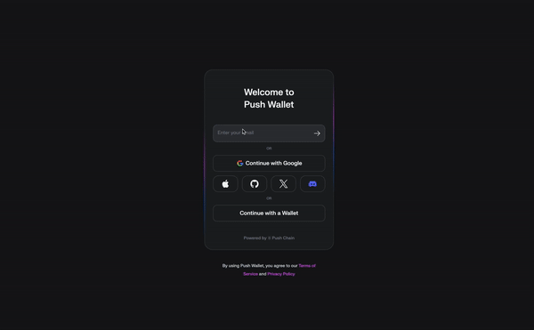

# Wallet Abstraction

Push Chain simplifies wallet interactions by supporting transactions from any chain, enabling compatibility with any wallet, and offering an embeddable wallet for the best user experience (UX). These features make onboarding and interacting with Web3 applications intuitive and seamless, catering to all types of users.

<head>
  <title>{`Wallet Abstraction | Push Chain | Push Documentation`}</title>
</head>

## Transactions from Any Chain, Any Wallet

Push Chain enables users to interact directly with the blockchain using their existing wallets—whether they’re EVM-based or non-EVM-based. This removes the need to switch wallets or migrate between ecosystems, ensuring that all transactions and interactions happen smoothly, regardless of the chain or wallet being used.

## Embeddable Push Wallet for Enhanced Experience

For users seeking a streamlined interface, Push Chain provides an embeddable wallet that enhances the user experience by combining simplicity with security. The embeddable wallet offers:

- **Unified Access**: Unified Access: A single wallet interface to interact with Push Chain, supporting both cross-chain and on-chain transactions.
- **Frictionless Onboarding**: New users can log in with email or social accounts, providing a Web2-like experience while maintaining Web3’s security and decentralization.

## Logging in with Email

Push Chain introduces email-based login, bridging the gap between Web2 and Web3. This feature enables new users to easily onboard without needing prior blockchain knowledge while ensuring secure interactions.



## Example: Connecting a Wallet with Push Chain

Here’s how you can use the Push Wallet SDK to connect a wallet in your web3 application:

```typescript
async function pushWalletLoginHandler(): Promise<void> {
  try {
    if (pushChain) {
      // Establish wallet connection
      const pushAddress: string = await pushChain.wallet.connect();

      // Process and store the connected account
      setPushAccount(pushAddress);
    }
  } catch (err) {
    alert(`Error connecting to Push Wallet: ${err.message}`);
  }
}
```

## Key Features of Push Chain Wallet Integration

- **Cross-Chain Compatibility**: Transactions from any wallet and chain are fully supported, providing maximum flexibility for users.
- **Embeddable Wallet**: Developers can integrate a seamless wallet experience into their web3 applications for improved user interactions.
- **Email Login**: Simplifies the onboarding process for new users, making it accessible to Web2 audiences.
- **Decentralized Identity (DID)**: Push Wallet creates a unique identifier for each user, unifying actions across multiple blockchains.

## Wallet Connection Flow

1.	First-Time Connection: Users logging in for the first time are prompted to create an account.
2.	Wallet Selection: Users select their preferred wallet (EVM or non-EVM) and sign a message.
3.	DID Creation: A Push decentralized identifier (DID) is generated and linked to the user’s wallet.

Push Chain’s wallet abstraction makes it easy for developers to create inclusive and powerful web3 applications, ensuring a seamless experience for users from all backgrounds and technical expertise levels.