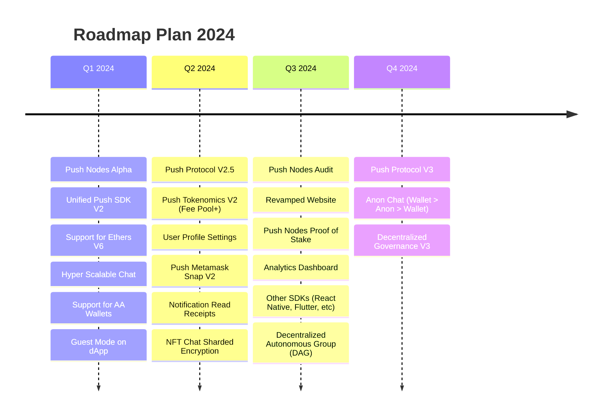

# Overview
###### _**{LAST_UPDATED}**_

Live roadmap is a living document that will be updated as we progress through our roadmap. It will be refreshed constantly with new features, milestones and other important information as we progress through our roadmap.

<head>
  <title>Push Live Roadmap | Push Roadmap | Push Documentation</title>
</head>

## Live Roadmap

### Push Nodes Alpha _Q1 2024_
Push nodes will complete the final step of decentralization for Push and will be open for everyone to run and participate in securing the network, enabling genesis of Push Network (L2 for web3 communication).

Push network is a Proof of Stake network requiring nodes to stake [___`$PUSH`___](https://coinmarketcap.com/currencies/epns/ "$PUSH at Coinmarketcap.com") to secure the network. It will be able to validate, store and deliver notifications and user profiles in the alpha version.

### Unified Push SDK V2 _NEW_ _Q1 2024_
We started the journey of making our SDK more developer friendly with unified SDK to enable both chat and notifications in [4 LoC or less](/docs/ "Push SDK Documentation"). 

We will be taking this further with V2 of our SDK to encompass all forms of communication (Notifications, Chat, Video, Spaces) in a single SDK. 

:::note

V2 is a breaking change, we recommend all developers to join our [Discord server](https://discord.gg/pushprotocol) -> `#dev-announcements` channel for information on how to upgrade and best practices for easier transition.

:::

### Support for Ethers V6 _NEW_ _~Q1 2024~_
We will be upgrading our SDK to support Ethers V6 along with Ethers V5 and viem. This will enable developers to use our SDK with latest version of Ethers.

### Hyper Scalable Chat _NEW_ _~Q1 2024~_
Hyper scalable chat will allow asynchronous messages in DMs or groups enabling several users to chat without wait. It will also enable groups to have 50k-100k users in a single group.

## Completed Milestone

### Hyper Scalable Group _**Q4 2023[↗](/blog/hyper-scalable-group-chats/ "Benchmark article for hyper scalable group chats")**_
Push launched hyper-scalable groups allowing upto 5k users for private and 25k users for public groups. This enables protocols to create large communities of their users and engage with them in a seamless manner.

### Gated + Group Chats _**Q4 2023[↗](/docs/chat/build/conditional-rules-for-group/ "Developer docs on conditional gating of groups")**_
Push launched gated chats for web3 protocols to enable them to create gated communities for their users. This enables protocols / DAOs / NFTs to create a community of their users and engage with them based on the gamification of their choice.

### Notification Settings _**Q4 2023[↗](/blog/introducing-notification-settings/ "Article explaining notification settings for Push and how to use it")**_
Notifications for web3 are synonymous with Push. With notification settings, protocols can provide notification settings for customized user preferences on a granular level.

_Q1 2024_

_**Q1 2024[↗](https://google.com)**_

_~Q1 2024~_

_~**Q1 2024**~_
