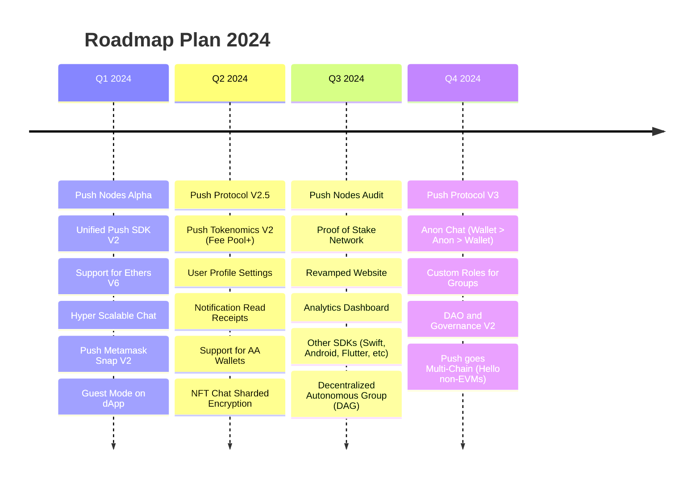

# Overview
###### _**{LAST_UPDATED}**_

Live roadmap is a living document that will be updated as we progress through our roadmap. It will be refreshed constantly with new features, milestones and other important information as we progress through our roadmap.

For feature request or support reach out to us support@push.org

<head>
  <title>Push Live Roadmap | Push Roadmap | Push Documentation</title>
</head>

## Live Roadmap

### Push Nodes Alpha _Q1 2024_
Push nodes will complete the final step of decentralization and will be open for everyone to run and participate in securing the network, enabling genesis of Push Network (L2 for web3 communication).

Push network is a Proof of Stake network requiring nodes to stake [___`$PUSH`___](https://coinmarketcap.com/currencies/epns/ "$PUSH at Coinmarketcap.com") to secure the network. It will be able to validate, store and deliver notifications and user profiles in the alpha version.

### Unified Push SDK V2 _NEW_ _Q1 2024_
We started the journey of making our SDK more developer friendly with unified SDK to enable both chat and notifications in [4 LoC or less](/docs/ "Push SDK Documentation"). 

We will be taking this further with V2 of our SDK to encompass all forms of communication (Notifications, Chat, Video, Spaces) in a single SDK. 

:::note

V2 is a breaking change, we recommend all developers to join our [Discord server](https://discord.gg/pushprotocol) -> `#dev-announcements` channel for information on how to upgrade and best practices for easier transition.

:::

### Support for Ethers V6 _NEW_ _**Q1 2024[↗](/docs/chat/build/initialize-user/ "Documentation supporting Ethers V6")**_
We will be upgrading our SDK to support Ethers V6 along with Ethers V5 and viem. This will enable developers to use our SDK with latest version of Ethers.

### Hyper Scalable Chat _NEW_ _Q1 2024_
Hyper scalable chat will allow asynchronous messages in DMs or groups enabling several users to chat without wait. It will also enable groups to have 50k-100k users in a single group.

### Push MetaMask Snap V2 _Q1 2024_
We bought notifications to MetaMask with our [MetaMask Snap](https://snaps.metamask.io/snap/npm/pushprotocol/snap/). We will be upgrading it to V2 to enable chat and other forms of communication in MetaMask!

### Guest Mode on dApp _NEW_ _Q1 2024_
We will be enabling guest mode on dApp to enable users to use Push without having to connect their wallet. Web3 needs to be accessible with the same ease as web2 and we are working towards it.

### Push Protocol V2.5 _NEW_ _~Q2 2024~_
Push Protocol V2.5 is a planned upgrade to Push Protocol V2. It will enable several new features and will be a major step towards Push Protocol V3. Features include adding dynamic fees for various premium functionality, splitting contracts to enable better gas management, etc.

### Fee Pool Expansion _~Q2 2024~_
Push Tokenenoics V2 further opens up the fee pool to enable more features. It also is a step towards Push Protocol V3 where crypto wallets will also be able to earn part of the fee from the fee pool, apart from token holders.

Some of the fee pool features it will add on for [___`$PUSH`___](https://coinmarketcap.com/currencies/epns/ "$PUSH at Coinmarketcap.com") are - **Incentivized Chat**, **Complex Gated Groups**, **Push Payments Fee**, etc. Read about tokenomics in detail [here](/docs/tokenomics/deepdive/$push/ "Push Tokenomics").

### User Profile Settings _~Q2 2024~_
With the unified SDK, Push user profiles handle everything from notifications to chat to spaces to video. Enabling user profile also enabled us to create intricate user profile settings to enable users to customize their experience on how they want to be notified, preferences for chat, audio, video, etc.

Apart from our anti-spam mechanism already in place for user-centric actions (ie: opt-in to get notifications, accept chat requests, etc). This opens up the possibility of users choosing who can message them, whether it's open to all, or another recipient needs to pay (with return option) to make it to their inbox. Same for who can video call them, if at all among other options.

### Notification Read Receipts _~Q2 2024~_
Notification read receipts is a popular feature requested by several protocols. Doing this in a decentralized manner is a challenge (who do you trust in interoperable environment?) but this seems possible with Push profiles that can silently sign these read receipts from a frontend. We will be working on this soon.

### Smart Contract Wallet Support _~**Q2 2024**~_
Push already supports Smart Contract wallets that conform to EIP-1271 standard. Though, we are not opening it officially since the decryption process for few AA wallets can be a security risk (When they store all signatures to execute a transaction). We have few ideas on how to solve this and will be working on it during this quarter.

### NFT Sharded Encryption _NEW_ _~Q2 2024~_
Push NFT Chat is the first of its kind NFT Chat that enables communication to be tied to NFTs! Read more about it [here](/blog/introducing-push-nft-chat-chats-and-comms-tied-to-your-nf-ts-done-right/ "Article explaining NFT Chat").

It's a game changer but does require an added step when it's transferred to another user for communication to get transferred. With the help of sharded encryption, we will be able to eliminate this step and enable smoothest experience for NFT Chat, even when you change wallets, or want to start afresh :smile:.

### Push Nodes Audit _~Q3 2024~_
Push Nodes Audit will be a third party audit of Push Nodes to ensure that it's secure and ready for production. Audit will likely include all relevant smart contracts and the node software on which the Proof of Stake network will depend for security.

### Proof of Stake Network _NEW_ _~Q3 2024~_
Proof of Stake launch will make Push Network (L2 for web3 communication) incentivized for every validator, storage, delivery nodes. It will enable anyone to run a node and participate in securing the network and get rewarded for it by earning [___`$PUSH`___](https://coinmarketcap.com/currencies/epns/ "$PUSH at Coinmarketcap.com").

Proof of Stake works by both incentivizing and penalizing nodes for their actions. Ensuring that the network is secure and reliable for all users and protocols.

### Revamped Website _~Q3 2024~_
We will be revamping our website to enable better communication of our vision, product and features focused on developers and users.

### Analytics Dashboard _NEW_ _~Q3 2024~_
Push Network is a decentralized network and we want to enable everyone to participate in it. Analytics dashboard will enable anyone to see the health of the network and how it's performing.

### Other SDKs _~Q3 2024~_
Push SDK is getting really popular with several protocols using it for their notifications and chat. We will be bringing new features of our unified SDK to other platforms like Swift, Android, Flutter, etc to enable developers to use Push SDK in their mobile apps with the coding language of their choice.

### Autonomous Group _NEW_ _~Q3 2024~_
Gated group chats have been a game changer for web3 protocols to create communities of their users and engage with them in a seamless manner. It allows for gamification of the community and enables protocols to create their own game theory for who can join the group, send messages and who can't.

The next step towards this is autonomity of these groups. We will be enabling protocols to create their own autonomous groups that can be governed by the community itself where the community can decide rules on who can join, send messages, be an admin, moderator or do several other things based on the gated logic. 

After all, DAO should have their DAGs free of any ownership unless it can be cryptographically set :smile:.

### Push Protocol V3 _NEW_ _~Q4 2024~_
We are bringing basket of tokens in V3, which means any fee pool action is not reliant on [___`$PUSH`___](https://coinmarketcap.com/currencies/epns/ "$PUSH at Coinmarketcap.com") but can use a number of stable coins with usage of [___`$PUSH`___](https://coinmarketcap.com/currencies/epns/ "$PUSH at Coinmarketcap.com") to pay fees at a discounted price.

This will enable more frictionless experience for protocols or users who want to pay for premium features. At the same time, since [___`$PUSH`___](https://coinmarketcap.com/currencies/epns/ "$PUSH at Coinmarketcap.com") is still required to get portion of the fee pool, the token will still be required to be held by protocols and users to get the benefits of the fee pool.

Apart for this, V3 will feature ability to split fee pool between token holders and crypto wallets along with some other features that we will be announcing soon.

### Anon Chat _NEW_ _~Q4 2024~_
Anon Chat is a feature that will enable users to chat with each other without revealing their wallet identity. Currently, wallet chats with another wallet but with anon chat, wallet can generate a temporary identity that can be used to chat with another wallet and then be discarded 🥷.

### Custom Roles for Groups _~Q4 2024~_
Custom roles for groups will enable protocols to create their own roles for their gated groups.

### Governance V2 _~Q4 2024~_
We started with progressive decentralized governance [phase 0 followed by phase 1](/blog/push-dao-progressive-decentralization-the-next-phase-of-push-governance/ "Article explaining Push DAO and how it works") and will be taking it further with phase 2.

### Push goes Multi-Chain _NEW_ _~Q4 2024~_
Push is cross-chain by design and already supports several chains like Ethereum, Polygon, BNB, Arbitrum, etc. It's time to enable Push to support non-EVM chains like Bitcoin, Solana, Avalanche, etc.

Push vision has always been to be the de-facto communication layer for web3. We imagine a future where a protocol of Solana is able to send a notification to a user on Ethereum that can be shown on Metamask (and vice versa), or a user on Bitcoin can send a message to a user on Polygon, and that a user is made up of several wallets on several chains. All of this is possible with Push and we will be working towards it :heart:.

## Completed Milestone

### Hyper Scalable Group _**Q4 2023[↗](/blog/hyper-scalable-group-chats/ "Benchmark article for hyper scalable group chats")**_
Push launched hyper-scalable groups allowing upto 5k users for private and 25k users for public groups. This enables protocols to create large communities of their users and engage with them in a seamless manner.

### Gated + Group Chats _**Q4 2023[↗](/docs/chat/build/conditional-rules-for-group/ "Developer docs on conditional gating of groups")**_
Push launched gated chats for web3 protocols to enable them to create gated communities for their users. This enables protocols / DAOs / NFTs to create a community of their users and engage with them based on the gamification of their choice.

### Notification Settings _**Q4 2023[↗](/blog/introducing-notification-settings/ "Article explaining notification settings for Push and how to use it")**_
Notifications for web3 are synonymous with Push. With notification settings, protocols can provide notification settings for customized user preferences on a granular level.

### Push Protocol V2 _**Q3 2023[↗](/blog/push-v2-is-live-new-rewards-utility-and-functionality/ "Article explaining Push Protocol V2")**_
Push Protocol V2 is designed to reward all participation in the network. Ensuring the start of creating a circular economy for web3 communication. 

It introduced yield farming v2 which includes rewards + fee earned by network! This is split among all [___`$PUSH`___](https://coinmarketcap.com/currencies/epns/ "$PUSH at Coinmarketcap.com") token holders based on the amount staked and the duration of time they have [held the tokens](/blog/new-push-yield-farming-rewards-full-details/ "Article explaining for Yield Farming on Push Protocol V2 works").

### Push Spaces _**Q3 2023[↗](blog/push-spaces-is-live-decentralized-audio-and-video-streaming-is-here/ "Article about Push Spaces launch")**_
Push Spaces is a decentralized audio and video streaming solution for web3. It enables protocols to create their own audio and video rooms for their users to join and interact with each other. 

It is built on top of composable parts of Push Chat protocol and Push Notifications protocol which means that it inherits their gating ability along with using notifications to exchange peer info for establishing the connection.

### Push NFT Chat _**Q3 2023[↗](/blog/introducing-push-nft-chat-chats-and-comms-tied-to-your-nf-ts-done-right/ "Article explaining NFT Chat")**_
Push NFT Chat is the first of its kind NFT Chat that enables communication to be tied to NFTs! 

It enables NFTs to be used as a key to unlock communication with other NFTs or wallets. You can use any NFTs to create a chat room and invite other NFTs or wallets to chat with them apart from sending notifications or conducting spaces with them.

### Push Video _**Q2 2023[↗](/blog/push-launches-wallet-to-wallet-video-chat/ "Article about Push Video launch")**_
Push Video is a wallet to wallet video chat solution for web3. It enables users to video chat with each other without having to share their personal information.

### Push Delivery Nodes _**Q1 2023[↗](/blog/empower-your-wallet-app-or-platform-with-push-delivery-nodes/ "Article about Push Delivery Nodes launch")**_
Push Delivery Nodes enable crypto wallets to deliver communication to their users including chat, notifications, video, spaces, etc. It enables services to run their delivery nodes that can listen to the Push Network and deliver communication to their users or perform actions based on any communication (encrypted) coming to wallet addresses they are listening to.

### Launch on BNB Chain _**Q1 2023[↗](/blog/push-protocol-launches-on-bnb-chain/ "Article about Push launch on BNB")**_
Push Protocol officially launched on BNB Chain after Polygon and Ethereum. As of now it supports BNB Chain, Polygon PoS, Polygon ZKEVM, Ethereum and Arbitrum. It will be supporting more chains in the future.

**Note**: Push Notification protocol is chain specific for delivering on-chain notifications. Other features of Push like chat, video, spaces, off-chain notifications, etc are chain agnostic and can be used on any EVM chain without needing additional support.